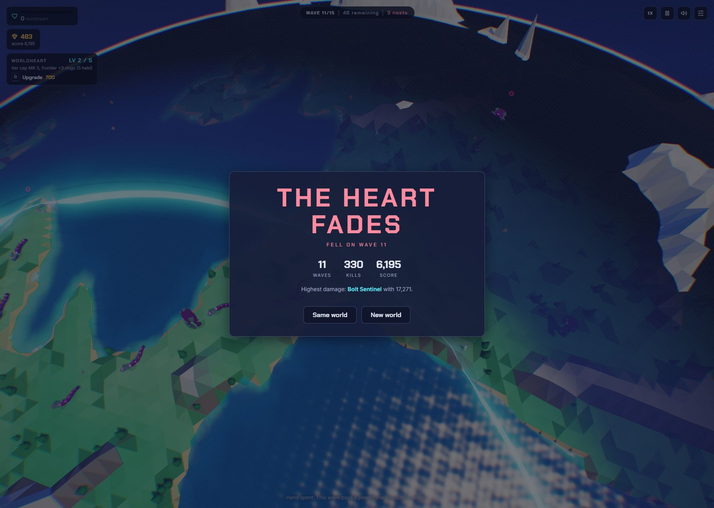
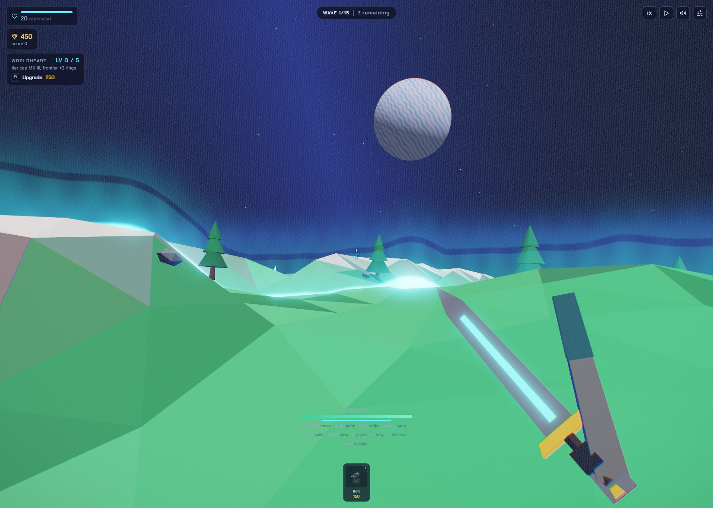

# Blind 99 Planets playtest and source retrospective

Date: 2026-09-05. Tested public URL: <https://majieddd.github.io/worldheart/>.
Audited commit: [`1374122d1109919a5fab10b69fefdfb80308eb6e`](https://github.com/majieddd/worldheart/tree/1374122d1109919a5fab10b69fefdfb80308eb6e).
Direction and next work: [99 Planets To Defend blueprint](../../99-PLANETS-TO-DEFEND.md) and [progress ledger](../../PROGRESS.md).

## Result and method

**Astra attempted the shipped mode blindly and lost naturally on wave 11 of 15: 330 kills, score 6,195, highest tower damage 17,271. No planet was completed.** The title calls the requested "99 Worlds" mode **99 Planets**. This is a first-attempt usability and gameplay sample, not a complete campaign certification.

The Astra tester received only the public game URL and instructions to learn through the shipped interface. It received neither repository documentation nor the owner's feature notes. An initial Chrome attempt became impractically slow under background throttling and stopped paused on wave 2, with 20 lives. For the second attempt, the parent operated a visible Codex browser as a relay: Astra chose actions from screenshots and accessibility text, and the parent executed them. No source, debug console, injected state, forced victory, or test helpers were used during either blind attempt. Relay latency particularly limits conclusions about short timed rewards, camera feel, and continuous combat input.

Run B gameplay and its terminal evidence were frozen before source inspection. Astra finalized its independent written record at 21:36 UTC without source access, then received the repository for a separate retrospective. The immutable originals are in [raw-evidence.zip](raw-evidence.zip), under `blind/`, alongside all 24 relay screenshots and available accessibility captures. [The manifest](raw-evidence-manifest.json) records original file sizes and SHA-256 hashes. Some AX captures are diffs. The summary below improves readability; it does not replace or retroactively correct the raw record.

The viewport was 1786 x 1272 in the visible relay. A settings read **after** the freeze reported effective seed **20308344**, quality Auto, shake On, lens 83/37 degrees, pitch 48/66 degrees, camera height 0.04/0.47 x radius, pan 100%, zoom 10%, look 100%. [Settings evidence](images/24-post-freeze-settings-ax.txt). The seed was not recorded before the blind attempt. Six subsequently fetched deployed entry/core/shell files matched the audited commit after line-ending normalization; this is a useful deployment cross-check, not an exhaustive historical asset attestation.



## What happened, without hindsight

| Stage | Decision and visible result |
|---|---|
| Opening | 450 gold, one Bolt card. Built east of the heart for 150, upgraded for 120. MK II was capped despite the heart panel saying MK III. |
| Waves 1-2 | Used 3X early, held 20 lives. Took Sharp Edge. Bought the first heart level for 250. Selected power stayed visible while paused, dismissed after resuming. |
| Waves 3-4 | Returned to 1X. Added and upgraded a second Bolt. Lives fell to 17, then 7. Added a Warden; its Dealt/Kills counters read zero. Took Flywheel. |
| Waves 5-6 | Lives reached 3. Raised a Bolt to MK III and added an emergency Bolt covering the southwest approach. A power offering included Hardened Heart, but expired before deliberate selection. Its eventual choice is unknown. |
| Waves 7-8 | Upgraded the emergency Bolt and Warden. Held 3 lives through several waves. Camera position changes complicated finding existing towers. Added another Warden. |
| Wave 9 | Bought heart level 2 for 450. An intended tower click entered a Warden soldier's first-person view instead. Discovered possession controls; Escape recovered the board. Raised a Bolt to MK IV. |
| Wave 10 | Added a third Warden and raised it to MK III. Lives fell to 1. Later saw "Mending taken" and "HELIOS unlocked" without deliberately selecting that power. |
| Wave 11 | Spent on three Bolt upgrades. Resumed at 1X; the heart fell. Final HUD: 0 lives, 483 gold, 46 remaining, 3 nests. |

The recovery at 3 lives was encouraging: concentrating fire near the heart and using Wardens produced several more defended waves. The loss does not establish that the mode is unbalanced. Initial placement, missed rewards, and limited direct control all affected this attempt.

## Blind observations, corrected classifications

Severity here is a triage proposal: P1 affects meaningful choices or advertised rewards; P2 causes friction or obscures feedback. It is not a production incident scale.

| ID | Visible observation | Retrospective classification and source | Follow-up acceptance |
|---|---|---|---|
| B1 / P2 | Heart cap text appeared one mark above the tower's enforced cap, at multiple levels. [Before](images/03-cap.png), [after purchase](images/05-heart.png). | **Copy ambiguity, not an arithmetic bug.** `ui.js:644-660` intentionally describes the next purchase, using `nextTierCap`; `modes/ninetynine.js:122-130` and `ui.js:937` agree on the current cap. | Show separate Current and Next upgrade values; verify all six levels, max level, and an open tower panel during purchase. |
| B2 / P2 | Clicking a power while paused left its panel visible. [Capture](images/06-after-choice.png). | Vote is recorded immediately, but resolves on the next run tick. Pause stops that tick (`run/draft.js:27-33,66-75`, `main.js:586`). The outline may be browser focus, not a designed confirmation. | In solo play resolve a choice immediately while keeping simulation paused, or explicitly show "Choice saved; resume". Test keyboard and mouse. |
| B3 / P2 | Several powers expired before deliberate selection; one Mending toast was seen. | Draft duration is 10 raw-dt seconds, with seeded random fallback when no votes exist. **Pause stops the timer; 3X does not triple it.** Relay overhead aggravated this. | Solo draft should wait for a deliberate choice by default. If timed mode is retained, show seconds and fallback policy. Test timeout boundary and pause. |
| B4 / P2 | Intended Warden tower click entered a soldier. Space changed from pause to jump; P pauses in a body. [Capture](images/18-possession.png). | Intentional possession with insufficient discovery. Ally proximity check precedes tower click handling (`modes/ninetynine.js:457-464`); overlap arbitration needs a controlled repro. Opening help also says generic "Drag to move" although this mode reserves left drag for marquee (`ui.js:178`, mode `:338-341,388-392`). | Teach actual mode controls; make possession explicit and predictable near towers; test select, build, patrol and possession priorities. |
| B5 / P2 | Warden panel displayed zero damage and kills across waves. | UI always reads tower counters (`ui.js:928-929`). Garrison AI damages enemies directly (`allies.js:794`), bypassing tower attribution (`towers.js:949-958`). This supports a reporting gap, **not a non-attacking Warden**. | Measure one soldier hit and kill, credit the owning barracks, and retain correct totals across respawn/sell. Audit player-controlled garrisons too. |
| B6 / P2 | View travel made existing tower locations difficult to reacquire. R did not return to the heart. [Mid-run frame](images/14-wave8.png). | **Do not claim pause freezes the camera or that travel is random.** Camera updates while paused (`main.js:575-577`); R only resets yaw/tilt (`camera.js:222-225`). Portal wake triggers a 1.1-second flight (`main.js:339-343`); possession exit flies to the heart (mode `:494`). The blind trace did not correlate every move with these events. | Record input/event/frame timestamps; prevent unsolicited travel during aiming/building; add a distinct Return to heart control; verify user input interrupts a flight. |
| B7 / P2 | Close framing and ridges made the core and approach routes hard to read initially. | Onboarding/visibility observation, not proof of an invalid generated map. Placement rejection reasons and luminous frontier helped once learned. | Fresh-profile tester can locate the heart, identify an approach, build a useful tower, and enter/release the commander using only displayed help. |

## What the source review revealed that blind testing missed

These are newly verified source facts or diagnostic results, not invented runtime observations. Several were already honestly listed in [GAMEPLAY.md](../../GAMEPLAY.md); this audit prioritizes and adds evidence for them.

| ID | Finding | Evidence and limits | Priority |
|---|---|---|---|
| S1 | Hardened Heart, Mending, Cryo Field and Chain Coil write modifier values without shell consumers. | Search of all `js/` files finds `livesAdd`, `heartRegen`, `slowAura`, `chainAdd` only in their definitions and power writers. [Reproducible diagnostic results](source-probe-results.json). Seeing "Mending taken" did not prove it healed us. | P1: every offered reward must work or be withdrawn with honest copy. |
| S2 | Generic tower power application misses several tower-specific fields. | Actual `Tower.stats` getter: Keen Rails Bolt damage 9 -> 10.08, Helios DPS 26 -> 26; Overclock Bolt rate 4.6 -> 5.06, Arc charge 1.5 -> 1.5; Chain Coil chains 3 -> 3. Warden summon time also remains 7. `towers.js:491-499`. No combat timing simulated by this probe. Warden rate semantics need design clarification, since it does not fire. | P1 for advertised offensive effects; define applicability per family. |
| S3 | Several permanent talent promises lack live effects. | Counting House adds gold to the run ledger but live `game.gold` stays config-owned. Veteran, Quartermaster and Scout have no `profile.bonuses` consumers in the mode; `progress.js:44-62`, mode `:20-24`. No purchases or storage mutation performed for this audit. | P1: test every purchased talent from fresh profile through reload and next run. |
| S4 | The current campaign is one 15-wave planet, not a traversable chain of 99. | `run/run.js` defines the single run; `modes/ninetynine.js:223+` banks victory and shows the ending; `progress.js:103-107` increments `planetsBeaten`. Counter growth is not a next-planet flow. | Product milestone, not a regression in an existing 99-world campaign. |
| S5 | Requested terrain and animation features partly exist already. | Shared height field, ranges/canyons, authored rig, strike-frame melee and hit FX exist. Building still requires walkable height/slope; oceans are blocked for ground traversal; flight uses terrain-relative altitude. No inventory, weapon loot or commander crystal-delivery system was found. | Extend existing owners; do not rewrite completed foundations blindly. |

Run the diagnostic from the repository root with Node 24:

```bash
node docs/qa/2026-09-05/source-probe.mjs .
```

It imports the actual tower getter with a vendored Three.js alias and minimal non-rendering browser-global substitutes. It also searches modifier consumers and fetches six public assets. It does not instantiate a game, render, prove actual DPS over time, modify source, or change a profile. Saved results refer to the audited commit; reruns on a later branch naturally describe that branch.

## Source-informed visual retry

After the freeze, used Same world, Begin, pause, then clicked the visible Bulwark. The fresh run UI reset to 20 lives, 450 gold, score 0 and heart level 0. This verifies those displayed reset values only, not full internal cleanup.

The commander's first-person silhouette shows a long rigid rectangular forearm projecting beside the blade, both on paused entry and after resuming and a click to strike. **This reproduces the owner's silhouette concern on the current public build.** It does not prove an inverted-normal defect or measure the swing timing. The view-model's arm geometry and transform are the first place to inspect (`viewmodel.js:159-178`). The historical polish log says inward slab winding was previously corrected; do not blindly reapply that fix.



The possession instructions are also low contrast against this bright ground in the captured frame. A scroll attempt while paused did not produce a confirmed third-person comparison, so that remains unverified. The retry was left paused on wave 1 and is not a second terminal attempt.

No systematic tree/bush artifact reproduction was obtained. Keep the owner's report open. Static faceted shading, RGB edge effects, alpha/culling problems and terrain intersections require separate A/B captures before attributing a cause. No audio or frame-rate judgment is supported by this tool-mediated session.

## Checks actually run and coverage still owed

| Check | Result in this session | Scope |
|---|---|---|
| `node tools/syntax.mjs` | 31/31 modules parsed | Syntax only |
| `node tools/test.mjs` | 128 passed, 0 failed, 0 skipped | Pure run core and bundler; the test named full-run victory drives the state machine, not an actual played victory |
| `node tools/style.mjs` before new docs | Pass, 66 files | House style only; final documentation check recorded in progress ledger |
| `node tools/deploy.mjs` + `git diff --quiet -- v2 dist` | Pass, no content drift | Windows line-ending-only stat noise in generated files was not a gameplay difference |
| Existing main CI | [Checks succeeded](https://github.com/majieddd/worldheart/actions/runs/33991070257), [Pages succeeded](https://github.com/majieddd/worldheart/actions/runs/33991069112) for audited head | Does not cover rendering or shell gameplay |
| Actual tower getter + live asset probe | Results saved above | Read-only diagnostic, not a new passing gameplay suite |
| Blueprint skill's `tools/blueprint.js` | Not run: bundled checker absent | Document structure reviewed manually; no checker pass claimed |

Publication integrity: [task-local document validation](document-validation.json) and [all 52 original archive entries verified](archive-validation.json). The local documentation check is deliberately identified separately from the unavailable skill checker.

Explicit gaps: waves 12-15 and boss, natural victory, commander defeat, nests manually destroyed, manual combat effectiveness, movement/sprint/jump feel, selling, talent purchase/reload, all powers/towers, profile migration, sound, performance, reduced motion, mobile/gamepad, all five map camera harness runs, and systematic foliage/depth audit. Future 99-world traversal, swimming, crystals, loot, and multiplayer cannot pass QA before they exist.

Next QA should first reproduce S1-S3 with actual live effects and fresh profiles; play a complete current planet to victory and commander defeat; then repeat with the new core loop. Keep natural UI runs separate from instrumented fixtures. Use fixed input/effective seeds, build SHA, frame/phase/time logs, exact inputs, expected/actual values and attached captures for every closed defect. The [blueprint verification matrix](../../99-PLANETS-TO-DEFEND.md#verification) defines feature-specific gates.
