# Environmental visual review

Captured from the production-backed Debug World after the final refinements.
Each exhibit was selected and rendered individually before composing these
contact sheets. This is source-informed visual QA, not blind play or a promise
that every procedural seed has been seen. Full captures remain in the local
`artifacts/active-worlds/debug-accepted` evidence folder.

## Revised formations and terrain packs

The glacial passage is roofed by a low bank-connected hill; the grotto roof
matches its walls. The cells are narrower and more numerous, the honeycomb
keeps open central entrances, and pedestals share the surrounding rock palette.
The arcade, open cavern network, progressive impact chain, ascending coil and
floating ribbons have distinct spatial structures. Deep Canyons emphasizes
depressed routes. The four replacements show caves, meteor chains, spiral
terraces and linked suspended islands rather than repeating ordinary hills.

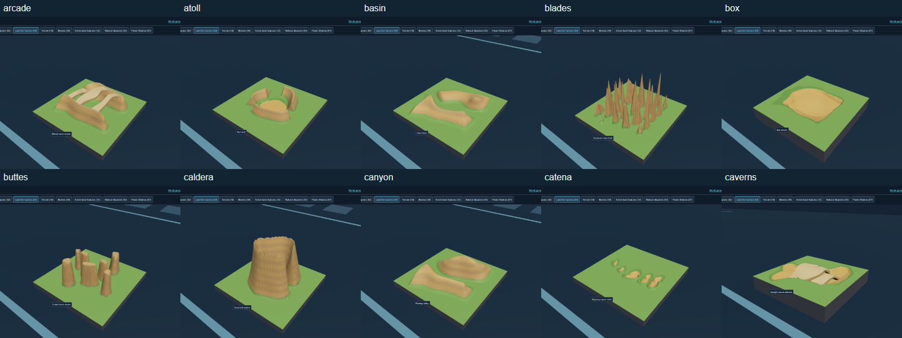
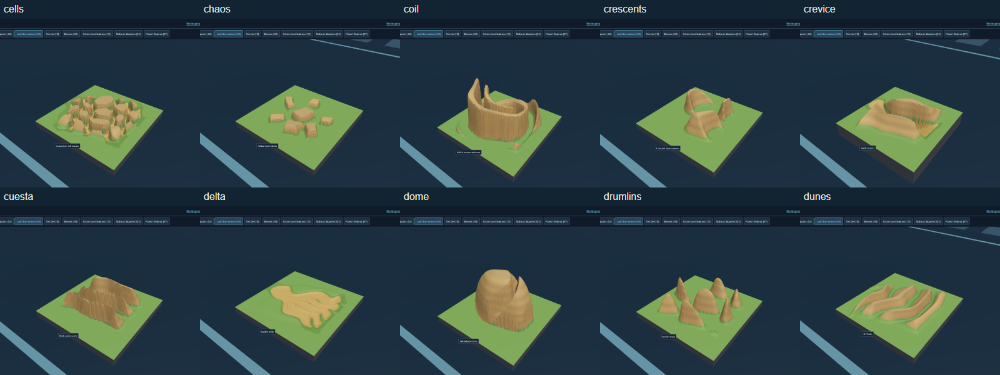
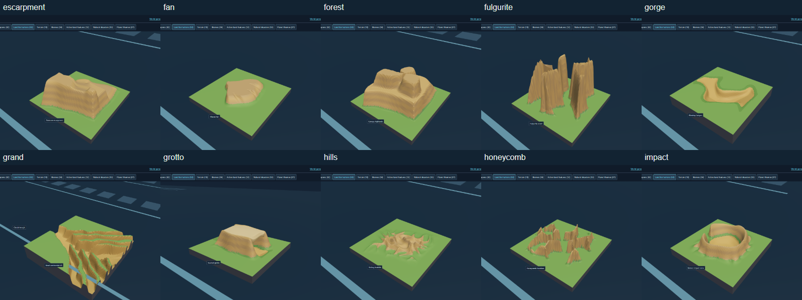
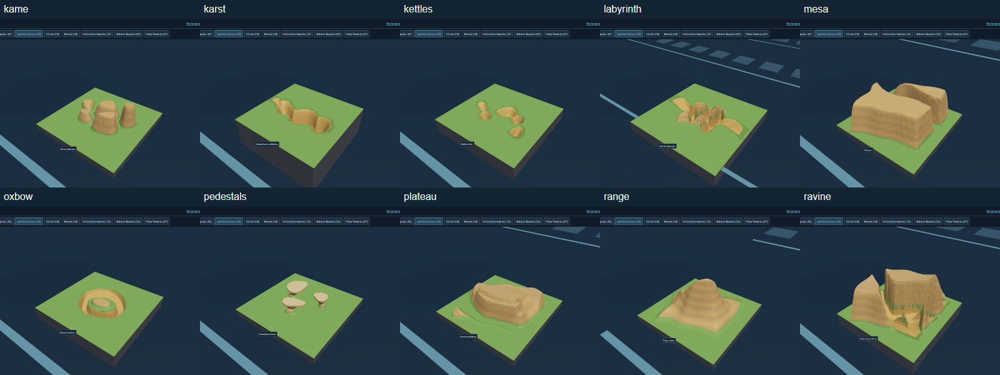
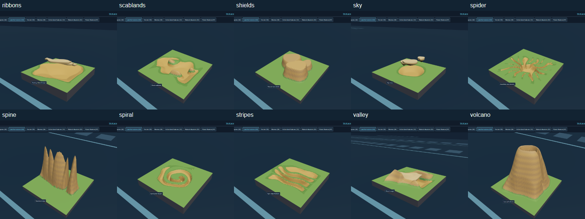
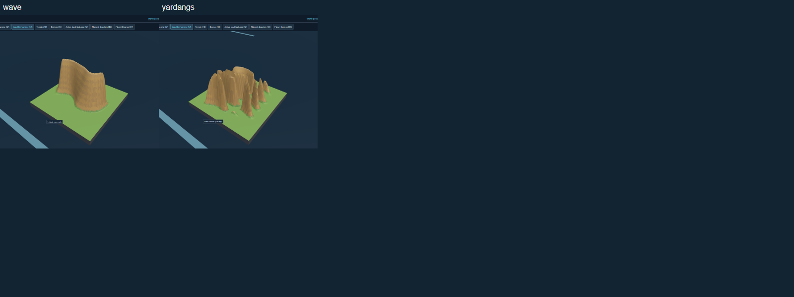
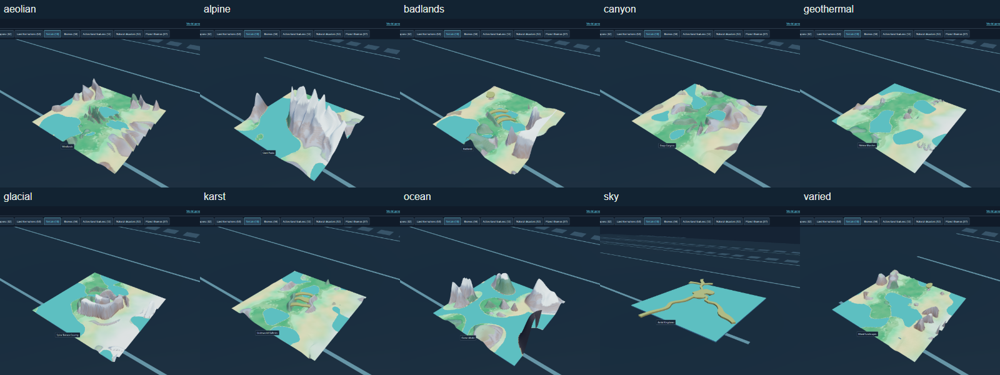

## Biomes

Tundra uses low ice blocks and frozen grasses instead of alpine spires.
The astronomical materials add crater dust, basalt, rust, tessera, cloud bands,
organics, nitrogen, water ice, stained ice and sulfur-rich volcanic plains.

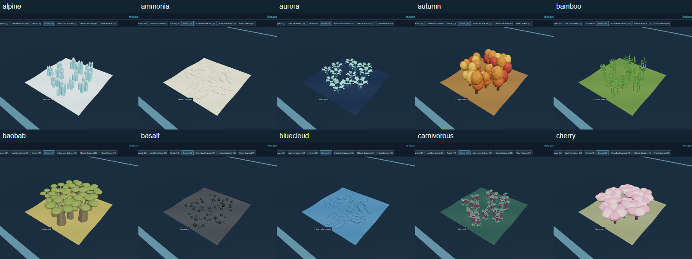
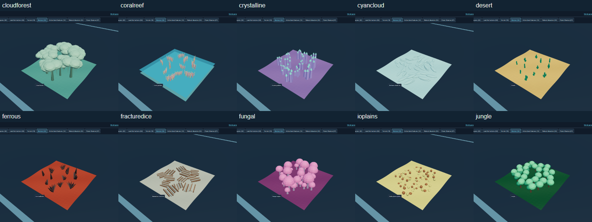
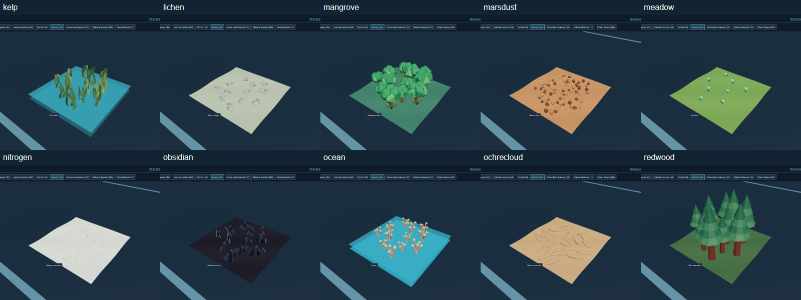
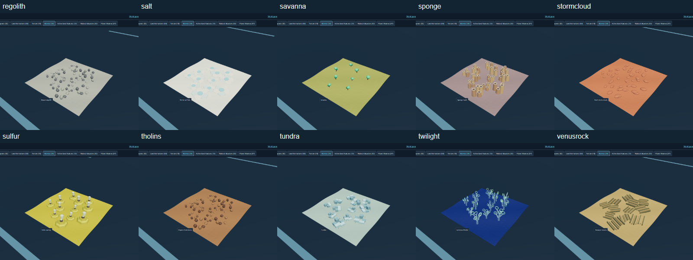
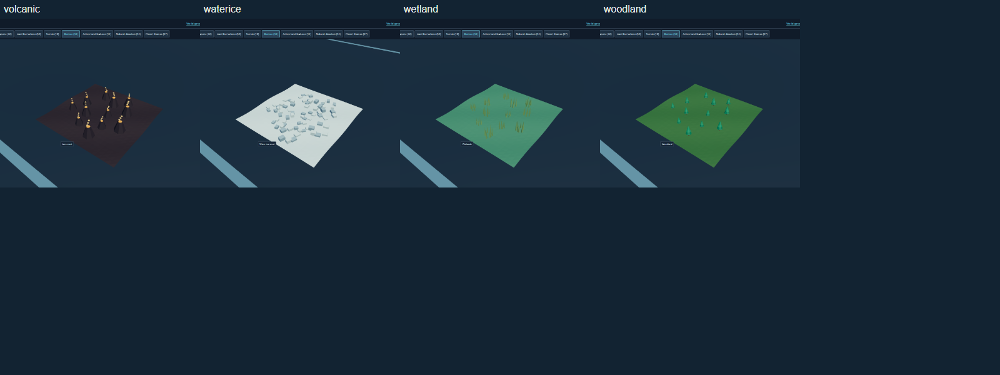

## Planet themes

Earth's continent mask, the Moon's dark maria, Mercury's Caloris basin, Mars's
divided rust terrain, Jupiter's red storm, Saturn's divided rings, sideways
Uranus, Europa's ice fractures and Pluto's bright heart are visible in their
miniatures. The giants use explicitly fictional walkable cloud decks.
Sky Archipelago exposes the air and water below its connected islands, with
cloud forest, luminous groves and pale high-latitude lichen on their tops.
All Planet's region mosaic is intentionally broader than an ordinary theme.

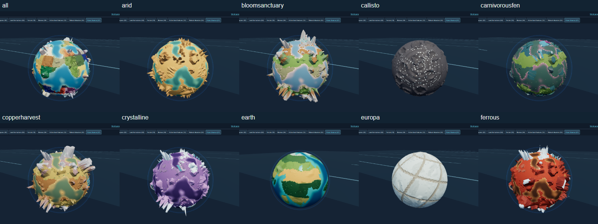
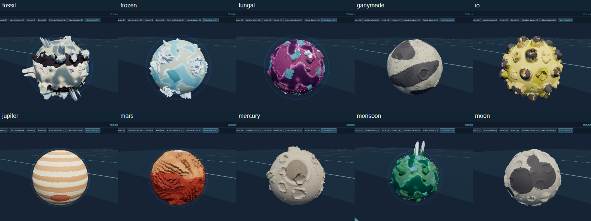
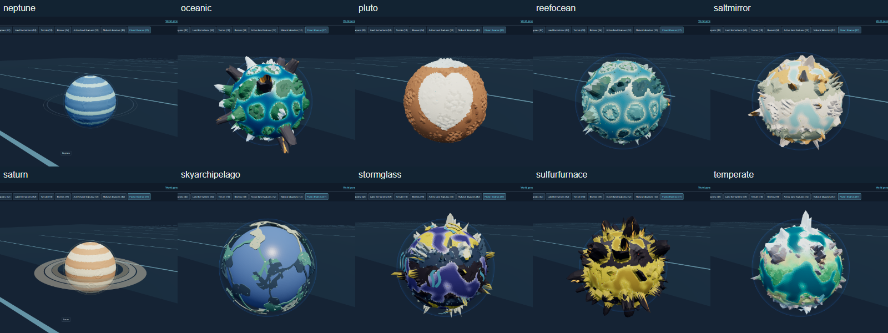
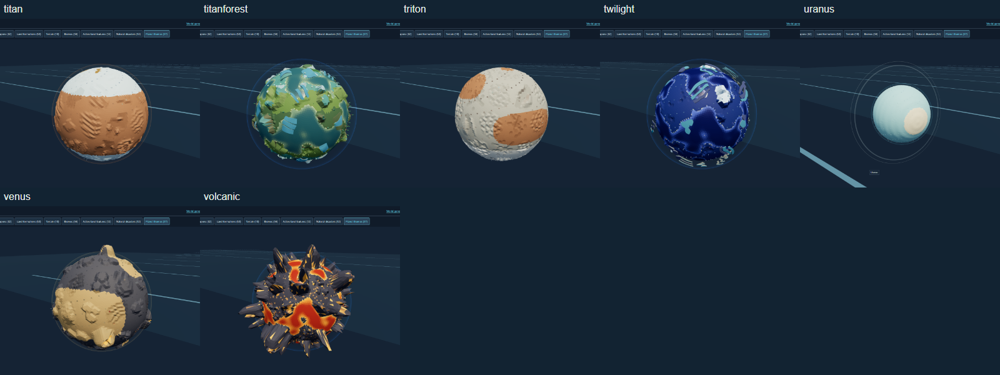

## Active features and disasters

Feature silhouettes distinguish flat geyser pockets, fallen trunks, bubbling
mud, mineral vents, lava seeps, fractured ice jets, crystals, spore colonies,
updrafts, springs, rock runnels and ocean vortices. The disasters demonstrate
their warning footprint and active phase on a loop in Debug. These still
images capture one phase; the gameplay checks verify the actual timed effects.

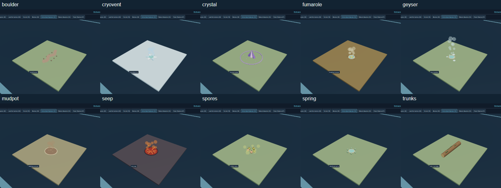
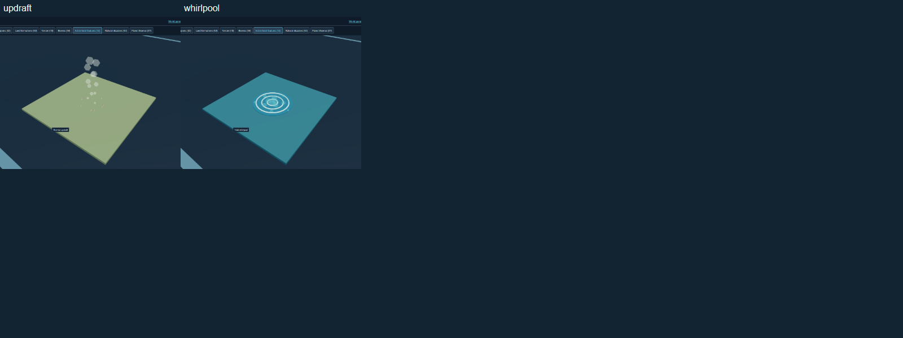
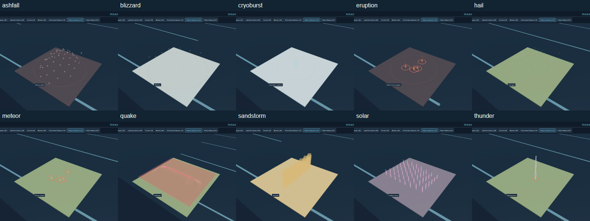
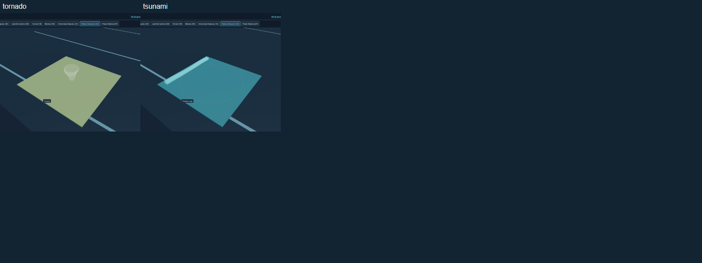

## Actual gameplay captures

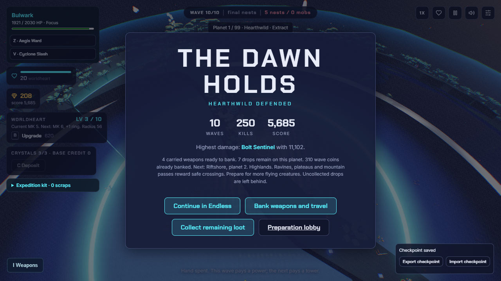
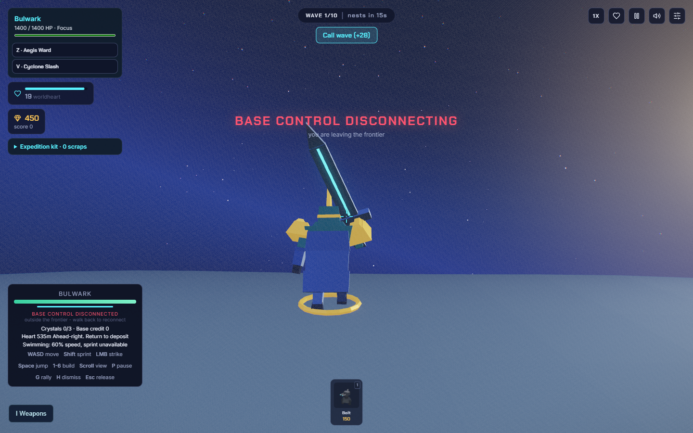
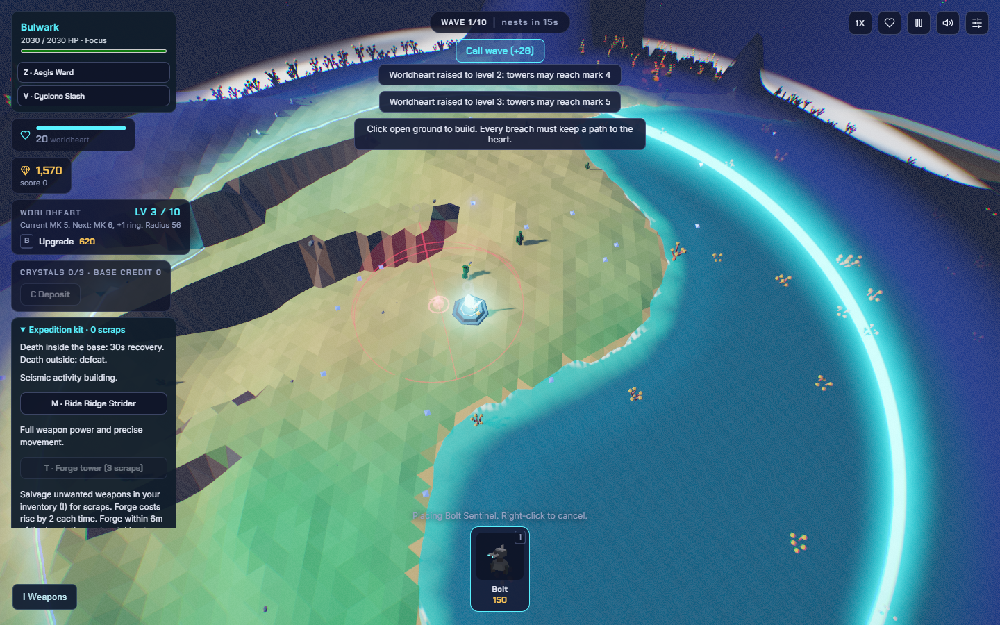
