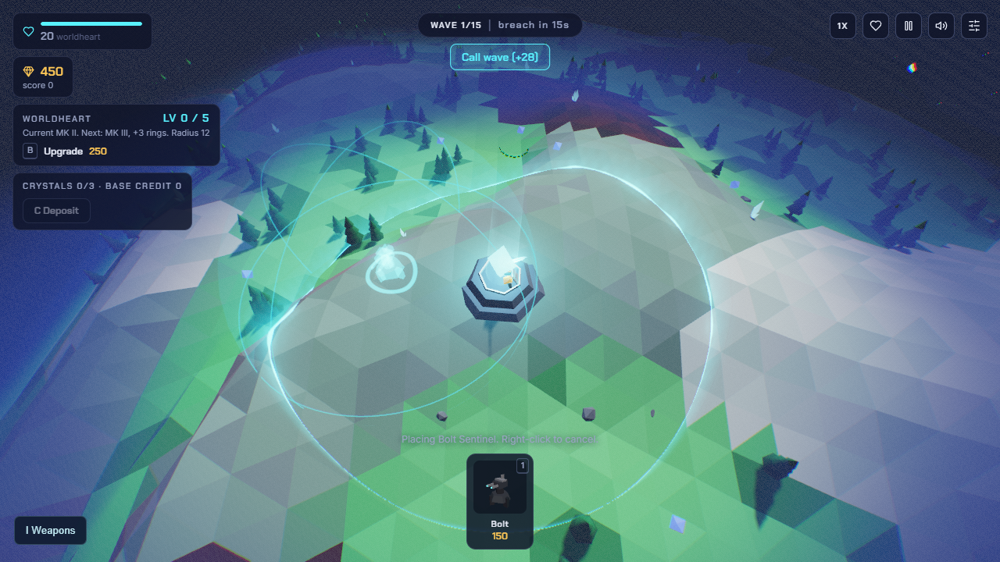
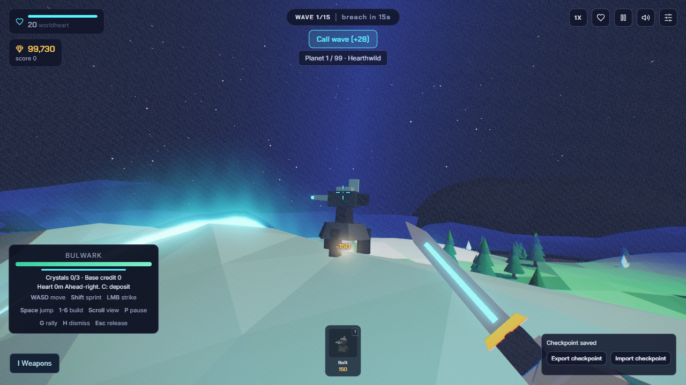

# Commander and tower placement comfort

2026-09-09. Owner: Codex. Branch: `feature/commander-build-comfort`, based on
`d79f1d6` from `origin/preview/v2`. Tracks #1, M1 #3 and M3 #5.
Status: locally verified, V2 publication pending. Usage unmeasured.

| Owner report | Implemented outcome | Evidence |
|---|---|---|
| Commander should not collide with trees | Pine and broadleaf geometry cannot obstruct the commander camera. Body movement already passed through decor and stays identical with trees present/removed. Terrain and tower barriers remain. | Six actual tree crossings; six tree and three rock camera queries; 21 decor and ten surface assertions |
| Spherical range preview lags and should be a see-through veil | Reusable depth-tested translucent spheres with restrained orbits, including the red mortar exclusion. No terrain remeshing or geometry replacement per move. Placement detours use the existing heart distance as a lower bound and never overwrite authoritative fields. | Rendered moving-preview timing, exact range geometry on four terrain profiles, 96 placement/oracle cases |
| First-person upgrade does not relock the camera | Successful Upgrade and Sell close inspection, clear button focus and resume pointer lock inside the activating click. Failed actions remain open; existing modal/terminal owners are respected. | Actual native browser pointer-lock and button/keyboard checks, plus refusal/drag-look fallback |

## Reproduction and corrections

The initial browser fixture passed 9/20. Trees blocked camera rays, guide work
recreated buffers with 6.2ms p95 CPU cost before rendering, and both Upgrade and
Sell left possession suspended. See [before](COMMANDER-BUILD-COMFORT/before.json).

Removing the range contour alone did not resolve full placement lag. The
rendered fixture exposed repeated full-field preview solves plus restoration,
with separate reachability sweeps during hover. An initial straight-line A*
preview still visited too much mountainous terrain. The final search follows
unaffected routes directly and uses the authoritative heart distance as a tight
lower bound for detours. Directed outgoing costs, required living enemies,
new nests, cache invalidation and generation rollover have dedicated checks.
Only actual placement changes authoritative ground/air fields.

Two old QA assumptions were corrected rather than converted into false passes.
The broad commander tool had a hardcoded old server and replayed boundary
coordinates from effective seed 28183 against the new 36102 layout. It now
accepts the requested base URL and explicitly labels that archive comparison
not comparable. Current-layout movement is verified by commander-surface-check.
The small placement unit-test doubles also needed the actual route helper and
heart field. The initial failures remain in the evidence directory.

## Verification

- [230 core tests](COMMANDER-BUILD-COMFORT/core.txt), 50 ESM modules parse,
  house style passes, generated V2/dist rebuilt with all 55 mirror files equal.
- [22 comfort checks](COMMANDER-BUILD-COMFORT/after.json),
  [28 contextual feedback checks](COMMANDER-BUILD-COMFORT/feedback.json),
  [14 UI edge checks](COMMANDER-BUILD-COMFORT/context.json),
  [21 decor checks](COMMANDER-BUILD-COMFORT/decor.json),
  [ten current surface checks](COMMANDER-BUILD-COMFORT/surface.json).
- [Five classic/campaign map camera regressions](COMMANDER-BUILD-COMFORT/maps.json)
  and [four terrain profiles](COMMANDER-BUILD-COMFORT/terrain.json), including
  maximum/minimum range, real targeting boundaries and climate placement.
- [96 cases](COMMANDER-BUILD-COMFORT/placement-oracle.json) compare acceptance
  with the preceding full reachability sweep and preview route costs with
  full Dijkstra. They include isolated required nodes, new/sold towers,
  directed terrain costs and unchanged live fields. The existing
  [180 point-route comparisons](COMMANDER-BUILD-COMFORT/point-path-oracle.json)
  also pass. Core tests explicitly cover one-way exits and generation rollover.
- [Fresh legal run](COMMANDER-BUILD-COMFORT/run.json): seed requested 12345,
  effective 36102, 15-wave victory, 24 heart health, 1,035 kills, score 19,510.
  [Actual extraction](COMMANDER-BUILD-COMFORT/arrival.json) reaches planet 2
  with 13 weapons. Ordinary purchases/cards/placements and commander actions,
  60Hz simulation with sparse rendering; not blind or full-campaign proof.

## Moving-preview performance

1280x720, same machine/GPU, paused combat, 240 rendered moving-ghost frames
following warmup. Native and DevTools 4x CPU cases are separate. CPU slowdown
is not a measured lower-end device. These numbers do not close the standing
full-combat/reduced-device performance gate.

| Case | Before p99 frame | Final p99 frame | Final median frame | Final maximum |
|---|---|---|---|---|
| Native | 117.4ms | 8.7ms | 7.6ms | 30.9ms |
| 4x CPU | 607ms | 22.9ms | 7.7ms | 30.6ms |

Guide-only work is at or below 0.1ms p95 in the final capture; values reported
as zero are below timer resolution. Geometry identities stay fixed instead
of hundreds of transient buffers. Retained
[baseline and veil-only attempt](COMMANDER-BUILD-COMFORT/performance-before-and-veil-only.json),
[first path attempt](COMMANDER-BUILD-COMFORT/performance-path-first-attempt.json),
[operation diagnosis](COMMANDER-BUILD-COMFORT/performance-diagnosis.json), and
[final capture](COMMANDER-BUILD-COMFORT/performance-verified.json).

## Handoff

Publish with `node tools/publish-preview.mjs` after committing and pushing the
feature branch. Verify Pages, build SHA, source and live asset hashes, then run
`tools/build-comfort-check.mjs` with WH_BASE_URL set to the public V2 URL and
`tools/preview-check.mjs` for root/save isolation. Main remains unchanged.

The owner can test the three changes by walking through trees, moving a tower
preview continuously, and aiming at a nearby tower then pressing F and Upgrade.
Full campaign, authored weapon-era art, broader device and owner feel acceptance
remain open; no umbrella milestone closes from this checkpoint.
