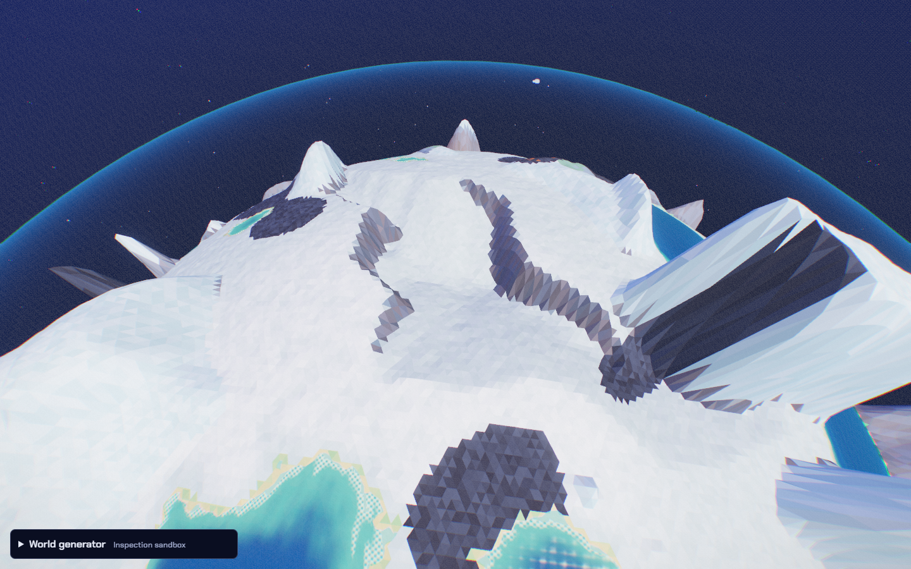
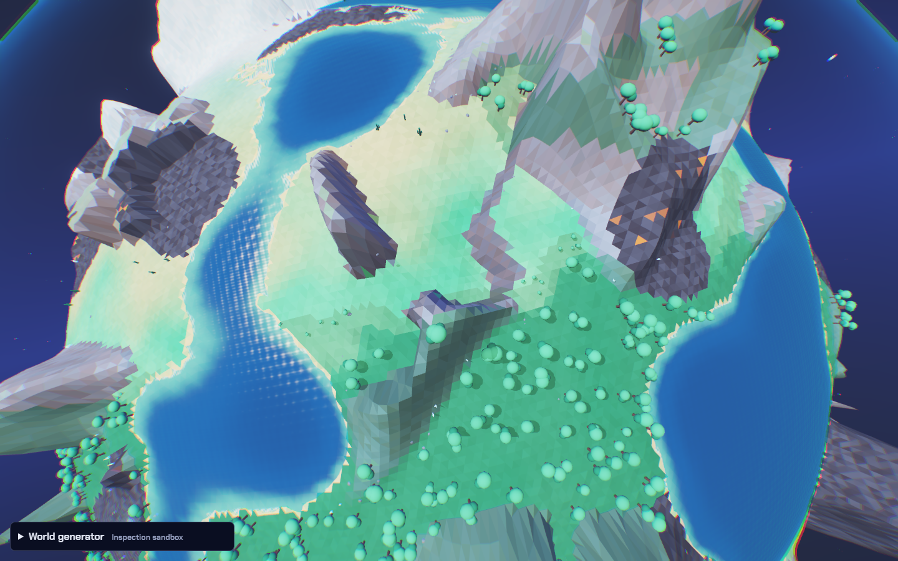
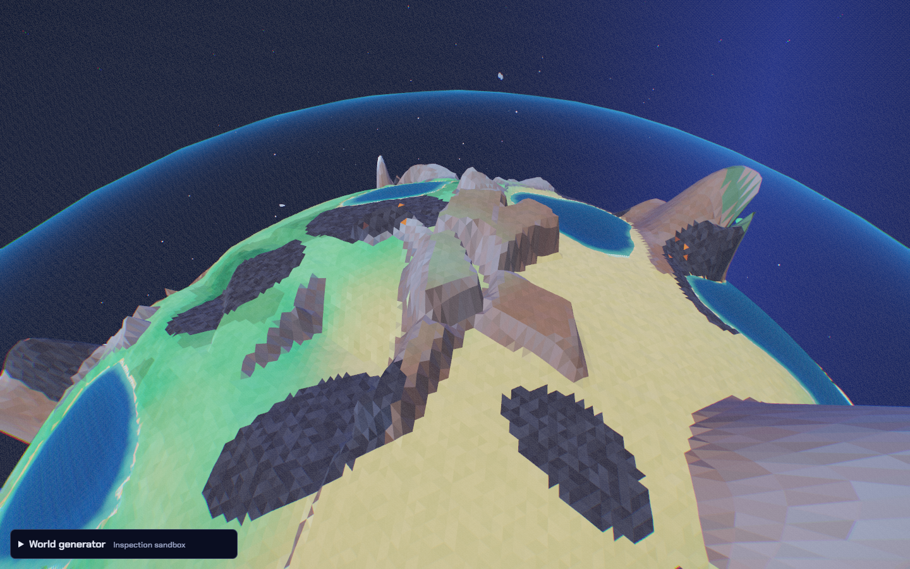
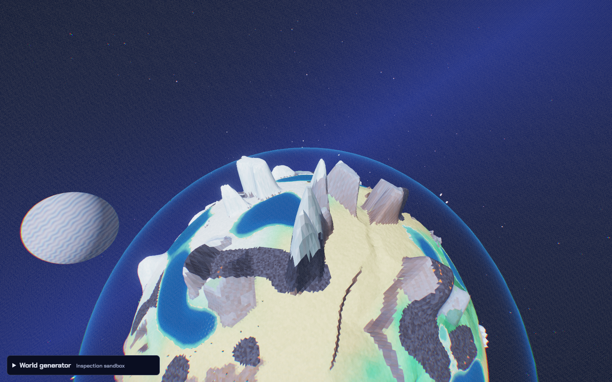
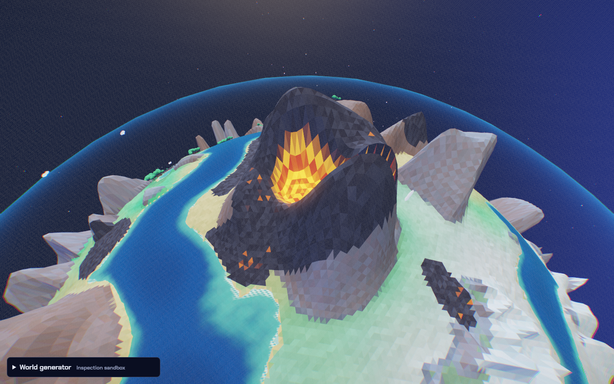
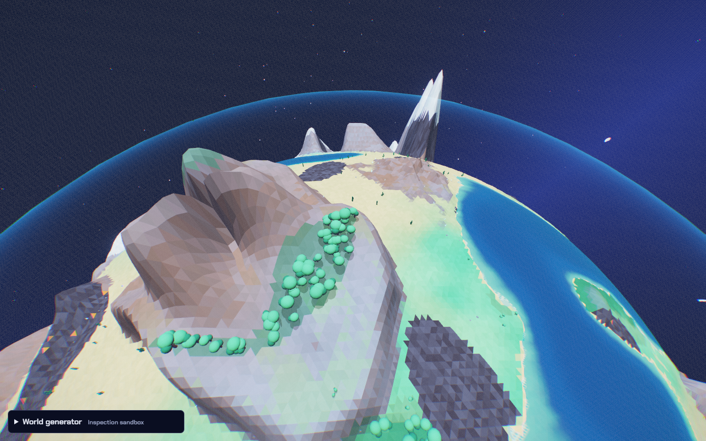
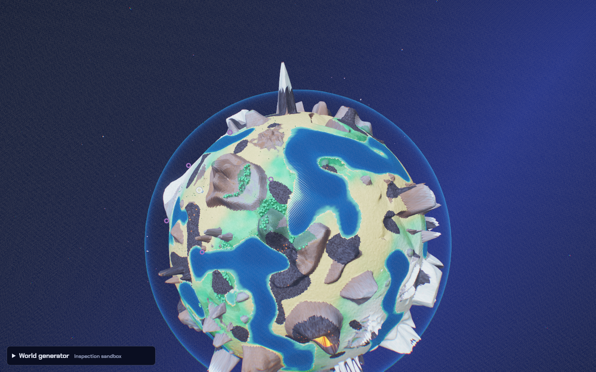
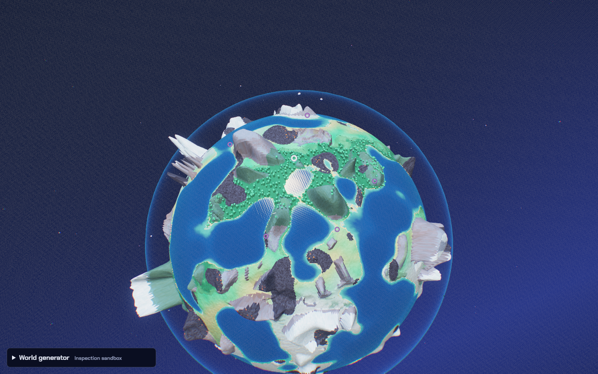
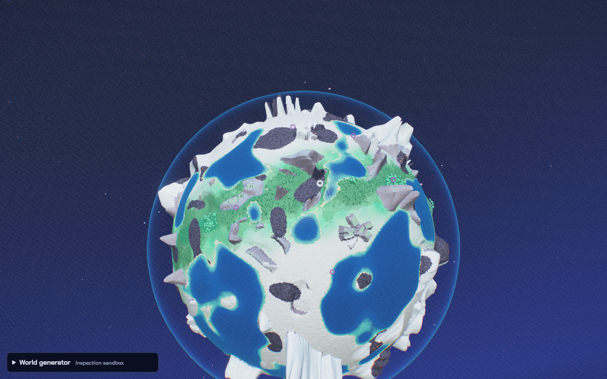

# Rendered landform review

These are screenshots of the actual generated game, personally inspected by
Codex during this change. Daylight inspection is enabled. They are controlled
views, not concept art or blind gameplay. All use requested seed 4206018157;
themes and accepted generation seeds are recorded in `visual.json`.

## Great continental rift

Sunbaked theme. The floor cuts below the planetary surface, with a long trunk,
a fork, and steep sides. It reads as an incision rather than two raised hills.
The visible selected floor reaches -16.7m. Coastal clearance limits its depth
near an ocean so its exits remain usable.

## Noctis labyrinth

Garden theme, overhead inspection. Crossing cuts leave separate upland pieces
and angular junctions, unlike the smoother erosion ravine. This is the most
subtle new silhouette: ocean clipping can leave only a fragment visible on
some planets. That variation is retained rather than claiming every generated
instance exposes a complete maze.

## Rafted crust blocks

Sunbaked theme. Broad tilted, angular slabs with gaps distinguish this from
rounded butte pillars. An earlier taller version failed this visual comparison
and was lowered relative to footprint before acceptance.

## Razorback ridge

Sunbaked theme. A narrow toothed wall has a much thinner profile than ordinary
mountain ranges. Its pass and surrounding low ground preserve routes; this is
a local Iapetus-inspired group, not an impassable ring around the whole globe.

## Lava spill volcano

Sunbaked theme. A dark cone surrounds a bright crater lake with a breached
rim and downhill channel. The material's moving crust pattern was verified
separately; a still image cannot prove motion. Reduced-motion preference
holds the pattern still. Lava uses existing hot-terrain placement rules.

## Canopy highlands

Sunbaked theme. Lobed shelves hold tree clusters above the surrounding lowland,
with open paths beneath the crowns. Forest coverage follows temperature,
height and slope, so these are wooded shoulders rather than an uninterrupted
canopy over every cliff. The inspector now prefers an actual jungle shoulder
over a bare snowy summit when one is available.

## Planet theme comparison

The same requested seed produces visibly different water coverage, snow extent,
vegetation and formation mixtures. The bright green equatorial band, dry
subtropics and snowy polar regions can be compared at globe scale.

Sunbaked:

Monsoon:

Frost:

See the [research, rejected controls and verification ledger](../COSMIC-LANDFORMS.md)
for source references and the limits of this evidence.
