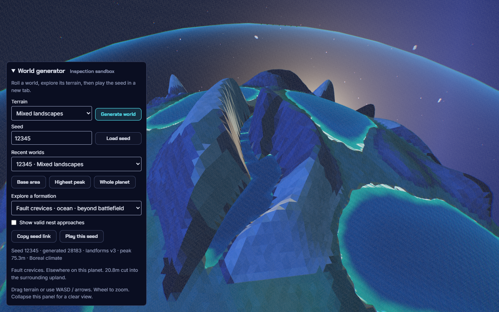
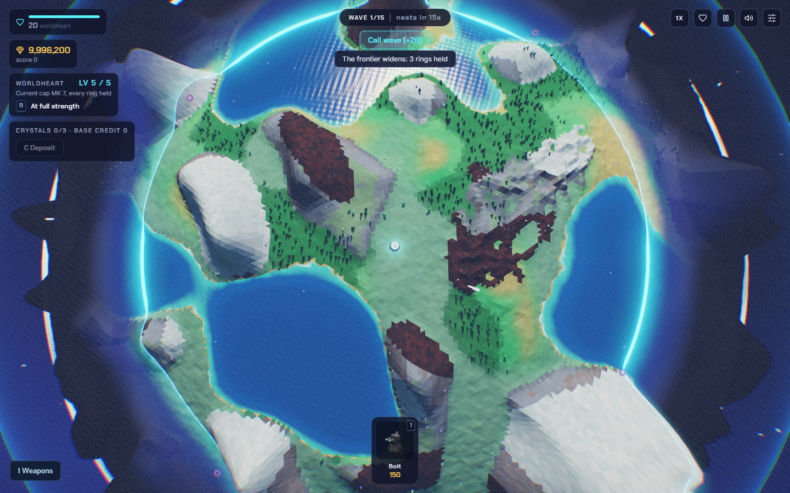

# Diverse planet landscapes, September 11

Owner: Codex, `feature/diverse-planet-landscapes`, based on preview `3a60ac1`.
U38-U40 / tracker #1 and terrain #5. Status: published and publicly verified
through [draft PR #31](https://github.com/majieddd/worldheart/pull/31), stacked
on #30. Main stays unchanged.

The owner likes the classic hills, Giant peaks and Deep canyons, and wants those
qualities within the same planets. Add plateau benches, ravines and crevices,
coherent biome regions and less obvious repetition. Update both the campaign
and its World generator inspector. Preserve the original classic formula.

Acceptance combines sampled same-world variety, deterministic geometry/climate,
real routes/nest clearings, rendered observation, tower placement/range,
actual moving enemies, a legal full planet, sustained performance and verified
V2 publication. This does not certify a full natural 99-planet campaign.

## Implemented

- U38: landforms v3 uses eight relief families within each of four mixes.
  The default is now named **Mixed landscapes**. Small irregular hills,
  major peaks and carved uplands coexist; geology provinces bias neighbouring
  family choices and mountain heights. Giant peaks still weights tall ranges.
- U39: terraced plateau benches, branching ravines and narrow fault crevices.
  Incisions descend into enclosing uplands. Crevices can fall below sea level
  and fill with water; outer valley joins remain open. Heights, widths and
  family weights remain authorable. Existing physical nest clearings, floor
  preference, slow emergency crossings and elemental tower rules remain.
- U40: independent seeded Temperate/Arid/Boreal/Lush climate biases combine
  with latitude, moisture and altitude to dress formation families in varied
  biome regions. Colours reuse the existing palette. Vegetation follows
  moisture, warmth, slope, surface biome and treeline, including mild benches.
  Climate dressing adds no new placement restriction or traversal penalty.
- The campaign uses the expanded profiles. Their range/canyon inputs are
  90/32, 96/32, 84/38 and 76/22; flyer ceilings are 28/38/30/28. These are
  height-field inputs, not maximum surface heights. Tower elevation bonuses
  still use actual height and acquisition geometry.
- **Explore a formation** in World generator focuses surveyed exposed
  examples, preferring this battlefield and labelling examples elsewhere on
  the planet. Incisions require visible banks on both sides. The inspector
  reports the climate regime, hides atmospheric battlefield haze and keeps
  separate saves, paused simulation, replayable seeds and normal play links.

The original classic formula, camera settings and deliberate equipment control
remain. This is geometric game terrain, not geological erosion simulation.
Each battlefield samples part of a planet; it does not guarantee all eight
families. Some Giant peaks fields are dominated by ranges. The catalogue labels
remote examples honestly instead of implying they are inside the playable cap.
Saved seed numbers regenerate with v3, including existing assaults. Inventory,
account and expedition schemas are unchanged; historical layouts require their
original source version. The inspector's links replay the requested seed with
the current generator, including deterministic acceptance retries.

## Evidence

| Check | Result |
|---|---|
| Contracts | [269 tests](DIVERSE-LANDSCAPES/unit-tests.txt), including positive/negative relief bounds, flat benches, incisions, spatial oracle, continuity, climate determinism and sea-cliff rejection |
| Real terrain and routes | 100 assertions over sixteen worlds, four profiles at requested seeds [12345](DIVERSE-LANDSCAPES/routes/12345.json), [771](DIVERSE-LANDSCAPES/routes/771.json), [92741](DIVERSE-LANDSCAPES/routes/92741.json), [2387895531](DIVERSE-LANDSCAPES/routes/2387895531.json); all pass |
| Same-playfield variety | Seed 12345 Mixed landscapes exposes 75m ranges, 4.7m hills, 25m canyon banks and 14m ravine banks in the sampled graph. Seed 771 combines 70m ranges, 7.7m hills, 22m plateaus and 27m ravine banks. All sixteen playfields include multiple biome regions |
| Moving enemies | [15,147 arrivals across all 99 definitions](DIVERSE-LANDSCAPES/all99-arrivals.json): 17 physical nests at three expansion levels, Husk/Mite/Wisp, no stranded bodies, floor escapes or ceiling violations |
| Rendered integration | [96 terrain cases](DIVERSE-LANDSCAPES/terrain.json), [96 placement cases](DIVERSE-LANDSCAPES/placement.json), [all five camera harnesses](DIVERSE-LANDSCAPES/maps.json), [16 polar/input cases](DIVERSE-LANDSCAPES/poles.json), [64 zoom/loot cases](DIVERSE-LANDSCAPES/zoom-loot.json) |
| Inspector | [35 UI/save cases](DIVERSE-LANDSCAPES/ui/results.json): formation focus, keyboard input, seed replay, exact play handoff, 390/768/1280 layouts, classic comparison, storage isolation, clipboard fallback; no runtime faults |
| Classic compatibility | [96,000 exact sampled values](DIVERSE-LANDSCAPES/classic-equivalence.json) against `3a60ac1`: terrain/fine-height/forest/moisture, four original/space maps, three seeds. [Reproduction helper](DIVERSE-LANDSCAPES/classic-equivalence.mjs), run from repository root |
| Legal full planet | [15-wave victory](DIVERSE-LANDSCAPES/legal/run.json), 7 heart health, 564 kills, 11 nests destroyed, zero runtime faults or commander-policy stalls; [12 weapons carried to planet 2](DIVERSE-LANDSCAPES/legal/arrival.json) |
| Native performance | [60 seconds at 720p](DIVERSE-LANDSCAPES/performance.json), RTX 4080 Laptop GPU, 30 towers/100 enemies: median 13.9ms, p95 14.1ms, p99 20.8ms, max 41.6ms; continuous simulation and pause/resume pass |
| Generated outputs | [59 bundled modules and 62 identical mirror files](DIVERSE-LANDSCAPES/generated-build.txt); [standalone inspector launch/regeneration](DIVERSE-LANDSCAPES/bundle.json) pass; source syntax and style pass |

The legal policy buys, places, fights and drafts through normal gameplay paths;
it advances time and renders one frame per two simulation seconds. It is not
blind or continuous-input evidence. Stress performance separately injects its
load. All-99 arrivals are isolated traversal, not a full natural campaign.
The native frame-budget pass is not a speedup claim or lower-end-device pass.
The previous build's different seed/workload distribution prevents attributing
its faster frame percentiles directly to this change. Broader profiling remains.

The overview gallery uses injected reveal gold/upgrades and inspection cameras.
The UI pictures use normal inspector controls. Neither is natural-play evidence
or a matched-camera before/after comparison.

## Retained corrections

1. The old [all-relief-nonnegative assertion](DIVERSE-LANDSCAPES/retained-corrections/nonnegative-relief.txt)
   failed after adding submerged crevices. Its replacement bounds negative
   relief and requires the crevice family. Other families/outer joins retain
   their prior nonnegative/zero contract. No route assertion was weakened.
2. The first [keyboard test](DIVERSE-LANDSCAPES/retained-corrections/select-arrow-oracle.json)
   expected the camera to remain still after a native select arrow changed the
   landmark. The corrected oracle checks the newly selected target and ensures
   no pan input leaks. That intended focus transition is not a camera defect.
3. Visual inspection caught a [lone sea cliff](DIVERSE-LANDSCAPES/retained-corrections/coastal-cliff.png)
   qualifying as a crevice shortcut. The survey now requires raised banks on
   both sides within the same formation; a geometric counterexample test and
   final rendered flooded-fault inspection pass.
4. An authored height override without an explicit family can resolve to a
   crevice. Its conservative depth envelope now includes those overrides too.
5. The first classic snapshot helper omitted Three's companion core file. It
   failed to import before sampling; copying the complete tracked library tree
   allowed the exact comparison. No failed sample was counted as a pass.

## Handoff

Gameplay source `26d956362f0eaeced5132c4bed15070a4b1e22b7` is live at
[V2](https://majieddd.github.io/worldheart/v2/) through
[deployment 34619009127](https://github.com/majieddd/worldheart/actions/runs/34619009127).
Review checks, Pages build and deploy pass. [Try Mixed landscapes in the generator](https://majieddd.github.io/worldheart/v2/?map=ninetynine&campaign=0&seed=12345&terrain=varied&worldgen=1).

All 115 public browser cases pass with no runtime faults: [35 generator](DIVERSE-LANDSCAPES/public/generator.json),
[64 zoom/loot](DIVERSE-LANDSCAPES/public/zoom-loot.json), [16 polar/input](DIVERSE-LANDSCAPES/public/poles.json).
[198 identity checks](DIVERSE-LANDSCAPES/public/identity.json) compare every
manifest-listed live original/preview asset and its corresponding git source.
Main remains `1374122d1109919a5fab10b69fefdfb80308eb6e`. Documentation-only
handoffs retain these tested runtime bytes; current deployment identity is in
`/v2/build.json`. Tracker #1 and terrain #5 retain the active integration context.

Owner landscape feel, broad
tactical balance, later legal campaign play, reduced-CPU/device coverage and
full 99-planet acceptance remain open. Rename/default migration, multiplayer
and ports retain their separate gates. Usage unmeasured.
