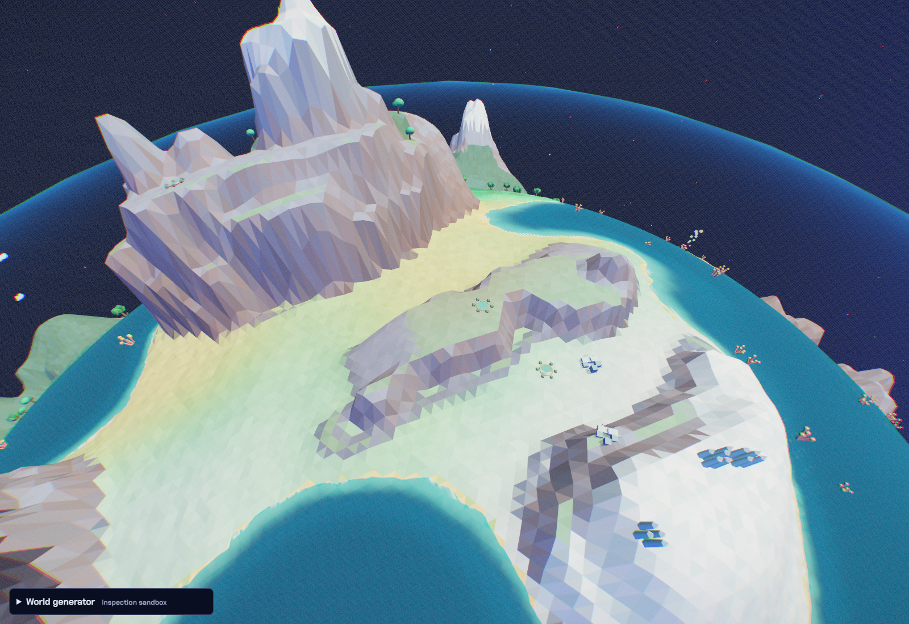
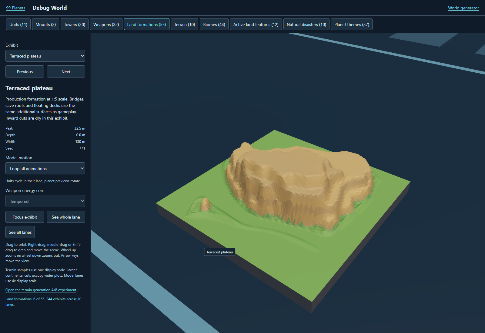

# Guided terrain in the full game

U200-U204. Codex on `feature/guided-planet-integration`, 2026-09-16.
Status: published and publicly verified. Owner approved Guided Terrain Kit 1.0.0 and requested full-game
integration. Tracker #1. V2 only; main remains `6133d07`.

## Contract

Preserve [the approved reference](../../../terrain-baselines/GUIDED-KIT.md),
including its tag and exact files. Adapt its shared-corner terrace profiles,
irregular quad topology and fitted overlooks to the closed spherical gameplay
surface. Keep biome/theme composition, coasts, dry canyon floors, layered
bridges/islands and gameplay navigation rules. Canyon routes must follow their
floor, without the demo's universal zero-height causeways.

New campaign worlds, generator previews, new homes and Debug World use the
production integration. Existing saved homes and active campaign assaults keep
their old terrain through an explicit generation version. Earth starter anchors
must be checked against the new field. Earthquakes deform the same surface after
the static kit; they must not regenerate the whole grid.

## Work and acceptance

| Item | Status | Acceptance |
| --- | --- | --- |
| U200 closed spherical kit and versioned field | Verified | Determinism, closed topology, shared edges, pole/seam samples, bounded cost |
| U201 full gameplay and save integration | Verified | New generation, saved geometry, campaign/home launch, no classic-map regression |
| U202 debug/generator inspection and landmarks | Verified | Production field visible, useful ledges and floor-following passages |
| U203 adversarial runtime and performance | Verified within stated scope | Real rendering/input, nest routes, tower placement, commander, quake; measured generation |
| U204 verified V2 publication and handoff | Published and verified | Syntax/style/tests, mirrors, PR, Pages identities and public runtime |

## Evidence

Five initial core checks pass: deterministic closed spherical topology, shared
edge inverse mapping, 30,006 independent direction queries including poles,
continuous terrace heights and low/deep floor preservation, and save versions.
The first actual headless planet traversal passes 15/15 enemy arrivals, without
floor or flight-height violations. The rendered Garden-world inspector exposes
24 fitted overlooks, each accepting its climate-compatible tower footprint.

The first full suite found an arcade bridge regression: changing one bank caused
autonomous units to choose a route underneath instead of across the roof.
The production adapter now protects authored multi-layer formations and both
abutments together, with continuous shared-corner blending around their bounds.
All four over/under bridge fixtures and the floating-island traversal fixture
pass after that correction. This protection also keeps floating worlds as real
layered islands, rather than converting them into single-height ground terrain.

The initial real browser pass is 17/17: six rendered world configurations
(Mixed/Garden, Canyons/Arid, Peaks/Frozen, Ocean/Pelagic, Mixed/Io and Sky), all
five ground/flying portal routes per world, campaign and capture version records,
new Earth entry, real held-key movement (7.48 m), starting home nests, a legacy
home reload, and production Debug World. No runtime, HTTP or shader errors.
Screenshot inspection confirms shelves in existing faceted materials, distinct
world silhouettes, retained dry cuts and a directly playable third-person home.
This initial pass predates the final raised-coast continuity and non-overlapping
overlook-bound corrections; final source is checked again during publication.

The quake forecast equals the full recomputation oracle on all nine tested
terrain/navigation arrays. Two rendered quake commits destroy disrupted nests,
retain tower footprints, preserve edits made during the warning, and resume.
Measured maximum commit slices: 13.1 / 6.2 ms. The second commit recalculates
occupancy after the injected tower edit while reusing its terrain samples.

The first load-cost comparison reached the harness's default 30-second navigation
timeout on Io (before its explicit boot wait). The runner now uses DOM readiness
and its existing longer boot deadline. This is retained as a harness failure,
not reported as a successful performance sample.

Final local checks: **393/393 tests**, **141/141 source modules**, style clean,
**250/250 generated mirrors**. The approved reference remains unchanged, 20/20
file identities. The follow-up lifecycle pass is **10/10**, including actual
collision/grounding driving up an overlook: 7.99 m climbed in 565 simulation
steps, maximum individual height change 0.021 m. The test begins at a fitted
ramp using an explicit position fixture; the earlier held-key check uses the
ordinary Earth spawn.

Landmarks now use spatial buckets and non-overlapping bounds; flat tile records
share vertex data and avoid per-cell temporary arrays. Consecutive identical
solar queries reuse their last result. A 12,000-direction production comparison
against the pre-optimization mirror has **zero height differences**.

Final same-host Chromium load comparison (cold pages, sequential runs): Garden
24.73 s legacy / 26.80 s guided; Io 25.47 s / 32.00 s. These are two bounded
samples, not a device benchmark or a speedup claim. The new surface adds initial
generation work, particularly to navigation/flight-clearance sampling on Io.
All compared portal topology counts match and no runtime errors occurred.
First-time world generation still has substantial loading and occasional long
tasks. Existing frame-budget scheduling remains in place; real mobile hardware
and a broader loading optimization pass remain qualification work.

Evidence files are in [GUIDED-PLANET-INTEGRATION](GUIDED-PLANET-INTEGRATION/):
initial-browser.json, initial-generation.json, lifecycle.json, quake.json,
optimization-parity.json, performance.json, baseline.json, tests.txt and syntax.txt.
Runtime checkpoint `f22e3b2349a5617e4f463a21a37e61bc44e2c2db` is deployed by
[Pages run 35109218353](https://github.com/majieddd/worldheart/actions/runs/35109218353),
with [PR #59](https://github.com/majieddd/worldheart/pull/59) retained for review.
All **493/493 live/source identities** pass, including unchanged main `6133d07`.
Additional planet-33 and planet-99 headless fixtures each deliver 15/15 enemies
without floor or flight violations: 45 arrivals across the three sampled worlds.

The first public harness reached boot-complete before the deferred inspector
import finished. The probe now waits for the actual inspector. A subsequent
public pass verified all six worlds and fitted tower shelves (8 cases), then a
GitHub Pages **503 for js/run/homeworld.js** interrupted the campaign navigation.
Both failure records are retained. The remaining lifecycle checks were retried
in a fresh browser: **10/10 pass**, with no runtime/HTTP errors. Together, **18
distinct public cases** pass: generation, placement, campaign versions, capture
snapshots, home entry, Earth routes, held-key movement, actual ramp grounding,
starting defense, old-save geometry, Debug World and error checks.

Public evidence: public-identity.json, public-generation.json,
public-generation-and-503.json and public-lifecycle.json. The corrected deferred
import wait lives in the shared probe, not in a duplicate test launcher.

Full 99-planet completion and real-device mobile acceptance are outside this
bounded terrain integration. Record discovered failures and fixes here.
