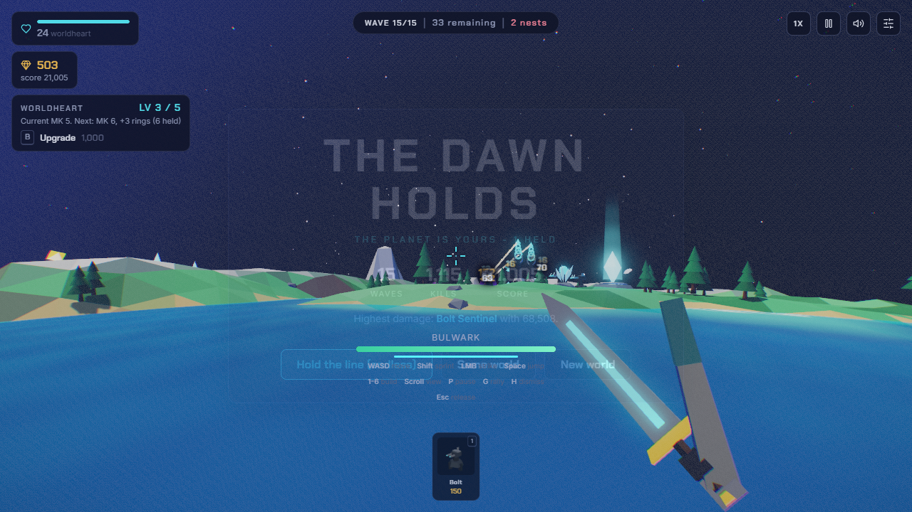

# M0: rewards, deliberate drafts and a complete planet

2026-09-05. Owner: Codex. Branch: feature/99-planets-integration.
This is implementation evidence; the original blind archive remains unchanged.

Fixed live health/capacity and wave healing, heart slow aura, Arc chains,
damage/cadence/range consumers across tower families, garrison attribution and
pooled ownership, Counting House, Veterancy and Scout. Critical chance on a
continuous Helios beam becomes its expected damage multiplier; discrete shots
roll a 2.2x hit. Fifth Volley explicitly applies to Bolt, Mortar and Arc.
Solo rewards wait for a choice and resolve while paused. Tower hits take
selection priority over nearby troops. Title controls and current/next caps
are explicit; long title/help panels scroll safely.

The source retrospective had one false positive: Quartermaster already worked
through optional chaining in the core. Its existing behavior is now a tested
healthy control. The implementation additionally found and fixed a cached
modifier mutation: each hand/base refresh had stacked another 15% commander
damage bonus. Repeated refreshes now leave the shell at 1.15 and core at 1.0.

| Evidence | Result | Scope |
|---|---|---|
| [Headless suite](m0/headless.txt) | 168 pass, 0 fail/skip | Actual tower stats, rare-effect methods, live resource consumer, all 13 talent purchases/reloads, core and build tests |
| [Browser fixtures](m0/browser-results.json) | 14 checks pass, no faults | Isolated profile; deliberately injected wave/reward events; not played waves |
| [Five-map regression](m0/regression.json) | All harnesses pass; defeat and Same world retry pass | 1280x720, installed Chrome on Windows; measured camera step budget only, not a rendering FPS certification |
| [Initial self-play](m0/defeat-run.json) | Commander defeat at wave 15, heart 24, 982 kills | Fresh profile, legal build/purchase/draft paths, simulation time advanced with WH.step |
| [Move-order experiment](m0/order-run.json) | Commander defeat at wave 12 | Orders allow nearby combat to interrupt walking; not an unconditional retreat command |
| [Direct-control self-play](m0/victory-run.json) | Boss victory, wave 15, heart 24, 1115 kills, score 21005, commander 1400/1400 | Fresh profile, input-based retreat from wave 12; no injected resources, enemies, powers or wave completions |



All self-play attempts requested seed 12345; worldgen selected effective seed
51940. Action traces are included. This is unforced instrumented play, not a
second blind or mouse-only human playthrough. The runner uses the same legal
placement, card and purchase paths, reads state, and advances simulation time.
Owner continuous-input feel review and broader seed/balance sampling remain
open. Do not read one victory as complete balance or full-campaign acceptance.

Reproduce with Node 24 and a local source server on port 8139:

```
node tools/test.mjs
node tools/browser-check.mjs
node tools/browser-regression.mjs
node tools/self-play.mjs 12345
```

Browser runners require an existing Playwright installation and Chrome.
WH_NODE_MODULES can point at its node_modules directory. The production game
has no dependency installation or package manifest. These runners use isolated
browser contexts and never edit the player's normal profile.
