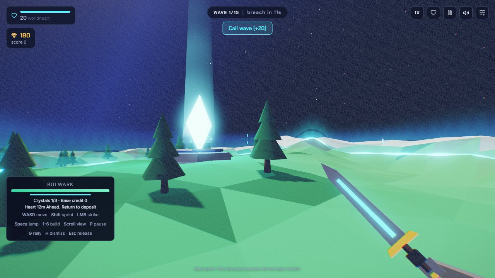
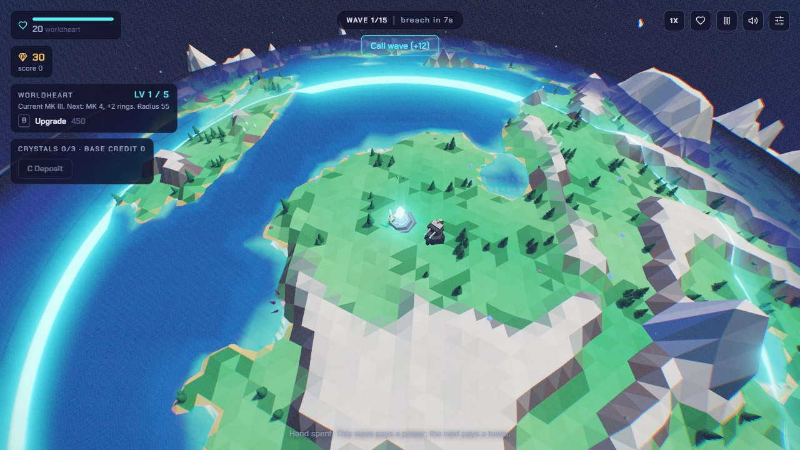

# M2: crystals and explicit base expansion

Owner: Codex, feature/99-planets-crystals, stacked on M1 PR #11.

Waves no longer expand or bank frontier rings. Buying a base level grants its
territory immediately. A commander can collect three reachable crystals, return
within 4.5 units of the heart, and press C or use Deposit. Each delivers 100
base-only credit; deposit cannot expand the circle. The upgrade panel quotes
the credit/gold mixture, uses credit first and rejects unaffordable purchases.
Cargo slows both AI and direct movement by up to 10% and is visible above the
commander. A direction/distance cue guides the return journey.

Identities and accounting live in a pure resource ledger. A separate seeded
stream chooses crystal nodes, so adding a cache cannot shift combat RNG.
Candidates must lie on the connected nav graph; the final graph is never
rebuilt when territory expands. Forward Scout still alters the opening
frontier only. Gold-only upgrades remain possible without an expedition.

| Evidence | Result |
|---|---|
| [Resource shell fixtures](m2/crystal-results.json) | 16 checks: reachable placement, no paused pickup, real travel slowdown, capacity, duplicate/remote deposits, credit-only and insufficient mixed payment, no wave expansion, death and reload |
| [Full run](m2/victory-run.json) | Fresh profile; requested seed 12345, effective 51940; unforced instrumented boss victory, wave 15, 1117 kills, heart 22, commander 1400/1400 |
| [Expedition action trace](m2/expedition-run.json) | Ordinary movement/look inputs; one crystal carried home, 100 credit deposited, then 150 gold + 100 credit spent on base level 1 |
| [Five-map regression](m2/regression.json) | All map camera harnesses and defeat/retry pass |
| Headless/reward/camera fixtures | 174 headless tests, 14 M0 browser assertions and 16 M1 camera checks pass |

The expedition trace records theta 0.05 at pickup and deposit; only purchase
changes it to 0.2298469388. No resources, wave completions or enemies were
injected into that expedition or the full run. The separate transaction runner
does inject positions and gold to exercise negative cases and is labelled so.





Reproduce using the optional browser runtime from [M0](M0.md):

```
node tools/crystal-check.mjs
node tools/self-play.mjs 12345 artifacts/expedition --expedition
node tools/self-play.mjs 12345 artifacts/full-planet
```

Assault resources intentionally reset on reload, as towers and run gold already
do. This batch does not implement the M5 versioned expedition checkpoint.
Broader seed sampling, terrain profile connectivity and balance of the first
55-unit upgrade radius continue into M3. Human continuous-input play remains
part of release acceptance, separate from the recorded instrumented runs.
