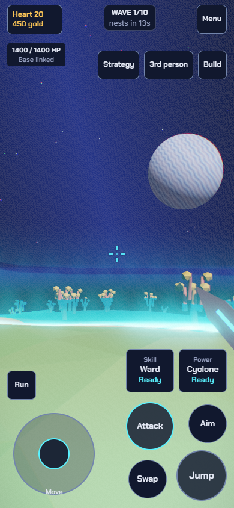
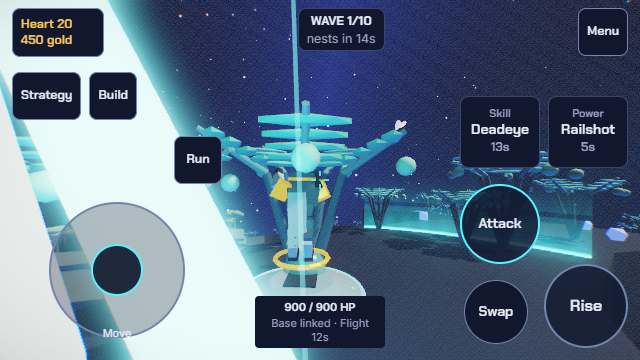

# Mobile performance and thumb controls acceptance

September 14, 2026. U132-U135, Codex, `feature/mobile-performance-polish`.
[Request ledger](../MOBILE-PERFORMANCE.md), [draft PR #42](https://github.com/majieddd/worldheart/pull/42).
Published and publicly verified as V2 gameplay `309aaa7b9a1d79bc7291f7a6c6b552c50cb3f45d`.
[Pages action](https://github.com/majieddd/worldheart/actions/runs/34830211318) succeeded.
[Public evidence](evidence/public/summary.json) records 125/125 touch cases and
[286 asset/source identity comparisons](evidence/public/identity.json). Main
remains `1374122d1109919a5fab10b69fefdfb80308eb6e`. This documentation closeout
follows the published gameplay commit; it makes no runtime changes.

## Controls

The 136px floating movement pad anchors under the landing finger, starts neutral,
and follows an extended drag. Jump is 84px, Attack 80px, Aim/Swap 64px and each
named ability 80x72px. The arrangement reserves the bottom-right jump corner and
bottom-left movement zone. Left-handed mode mirrors it. Short landscape views
keep perspective changes in Menu > Squad. Other mechanics remain in contextual
drawers; the center stays clear for aiming.

A weapon Power tap during attack recovery queues exactly one activation, yields
held basic attacks, fires when legally ready, then restores held fire. It never
cancels a strike or bypasses a cooldown. Menus, control loss and weapon-family
changes cancel the queued action. Ability names stay visible with cooldown time.
Attack and jump show immediate held feedback. Lobby movement uses the same stick.

## Runtime measurements

[Raw comparison](evidence/performance-summary.json), [before](evidence/performance-before.json),
[after](evidence/performance-after.json), [native speed](evidence/performance-native.json).
One Chrome 152 session, i9-13900H, RTX 4080 Laptop GPU, Windows 11. Each sample
ran for 60 real seconds with the same 30 towers, 100 replenished enemies and
seed. Fixture health/resources are injected to sustain combat. This is not
natural gameplay. Mobile viewport 844x390, device DPR 3; the game's unchanged
High preset uses rendering pixel ratio 1, four bloom levels and enabled shadows.
No enemy counts, model detail, terrain shapes or gameplay rules were reduced.

| Measurement | Previous route/render work, 4x CPU | Optimized, 4x CPU | Optimized, native CPU |
|---|---:|---:|---:|
| Median frame | 62.5 ms | 62.5 ms | 13.7 ms |
| p95 frame | 145.9 ms | 90.3 ms | 14.0 ms |
| p99 frame | 236.1 ms | 111.2 ms | 14.1 ms |
| Longest frame | 381.9 ms | 132.0 ms | 41.6 ms |
| Median FPS | 16.0 | 16.0 | 73.0 |

Long-frame p95 delay fell 38.1%; p99 fell 52.9%. The throttled case still fails
the absolute 60 median/30 p99 FPS gate. Native CPU passed it. These are bounded
desktop-GPU measurements, not proof of phone performance. Screenshots and CPU
sampling were excluded from the timed window. Startup timings are retained but
are not a controlled cold-load comparison. The post-sample median-regression
gate was evaluated against the same raw results and passed without resampling.

Point-route stamps avoid clearing a 415,081-node graph for every request. Weak
finite-edge regions reject impossible searches; a bounded exact-pair route cache
invalidates with construction or terrain revisions. Complete heart/air fields
stay separate. Terrain sectors share original vertex attributes; scenery uses
one compact batch per type, retaining shadow-visible instances and source IDs.
Terrain support lookups cache invariant trigonometry. Empty-world inspection
avoids unnecessary terrain raycasts. Hidden desktop nest labels skip projection
on touch; unchanged touch labels skip DOM replacement.

[Same-frame visual comparison](evidence/polish.json) retained all authored
settings. Close view submitted 1,423,481 vs 1,789,524 triangles, regional view
1,570,908 vs 1,793,490, and overview was identical. Maximum channel difference
was 7/255 in three channels of the regional view (0.00023% of its channels).
The other four views differed by at most 1/255. This samples five views including lateral aim changes, not
every possible planet. The stress fixture's median submissions also fell from
3.58M to 2.30M triangles; draw calls rose only from 490 to 532.

An independent [moving-camera stress run](evidence/moving-camera.json) passed
the same native-CPU gate: median 6.9 ms, p95 7.1 ms, p99 13.8 ms. It retained
a 166.7 ms maximum outlier as new regions appeared. This separate run is not a
paired before/after comparison and does not justify claiming hitch-free play.

## Verification

| Scope | Evidence |
|---|---|
| Static/core/shell | [334 tests](evidence/unit.txt), syntax and style checks; [106 identical mirrors, 98 bundled modules](evidence/build.txt) |
| Touch control regression | [46/46](evidence/touch.json), six viewports from 568x320 to 1024x768, both handedness and desktop restoration |
| New controls and render comparison | [14/14](evidence/polish.json), independent native fingers, queued Power, cancellation, genuine action hit areas |
| Tower/economy transactions | [16/16](evidence/transactions.json), placement, upgrade/sell, crystals, scrap forging and first-person return |
| Lobby, Debug and generator | [19/19](evidence/scenes.json) |
| Rewards, saves and Endless | [20/20](evidence/overlays.json) |
| Squad and desktop orders | [10/10](evidence/orders.json), real routes, patrol and moving dotted previews |
| Route oracle | [180/180 cases, four terrains](evidence/path-oracle.json), both directions, blocked/reopened endpoints, explicit bridge heights and unchanged heart field |
| Natural geometry and EMP | [20/20](evidence/natural-worlds.json), actual upper bridge movement, floor rewards and tower EMP lifecycle |
| Quake/tornado | [Native frames](evidence/weather.json): p95 13.9 ms, p99 14 ms, max 62.4 ms, preserved footprints and resumed simulation |
| Cameras/classic modes | [7/7 suites](evidence/cameras.json), including oversized All Planet and Saturn rings |
| Full defense | [Ten-wave victory](evidence/defense.json), 20 heart lives, 278 kills, six towers, no runtime faults; [Planet 2 arrival](evidence/arrival.json) preserved inventory |

The defense used legal purchases, cards and placements with deterministic time
advance and sparse rendering. It injected no health, gold, waves or enemies.
It is an instrumented policy with the touch HUD, not an unassisted touch-only
playthrough or an FPS benchmark. Its `weaponLoop:false` is retained: an item
was collected, but that run did not demonstrate equipping it. Inventory touch
transactions are covered separately. The other 98 planets remain unplayed.

## Rejected iterations and test corrections

- [Many-draw scenery attempt](evidence/rejected-draw-calls.json): fewer triangles
  but much slower median frames. Replaced with one compact batch per species;
  the performance gate now rejects a greater-than-10% median regression.
- [Native finger trace](evidence/retained-touch-driver.json): the old test driver
  released surviving movement/fire IDs when the skill finger lifted. Corrected
  CDP release semantics; actual three-finger queue/recovery now passes.
- [Covered order destination](evidence/retained-covered-order-target.json): the
  old probe tapped the newly relocated HUD instead of the canvas. It now chooses
  an exposed, legal destination, exactly as the desktop probe does.
- [Small-screen density](evidence/retained-transparent-stick-density.json): the
  old metric counted the entire transparent floating-stick capture rectangle as
  opaque UI. Painted panels/circles are now measured separately; full touch
  rectangles still must not overlap or cover the aim center. The 568x320 layout
  retains larger controls and passes both checks.
- The route fixture now fixes `planet=temperate`, supplies both endpoint heights
  and verifies `routeEdgeOpen` for layered movement. Its old point-direction
  probe could confuse a bridge with its floor. Native ally/enemy bridge movement
  also passed, independently of the graph oracle.

## Remaining limits

Physical Android/iOS thumb feel, mobile GPU load and sustained heat/battery use
need owner/device acceptance. 4x CPU throttling is a stress proxy and remains
below the absolute smoothness goal. No claim of eliminating all mobile lag.

A [pre-existing generation failure](evidence/retained-auto-theme-generation.txt)
for automatic-theme seed 12345 with an explicit alpine terrain override also
reproduced with the prior reference modules. It is a separate world-generation
compatibility follow-up, not a route-search regression or a passing test.
