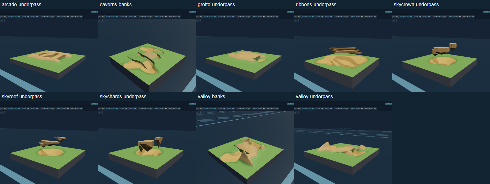
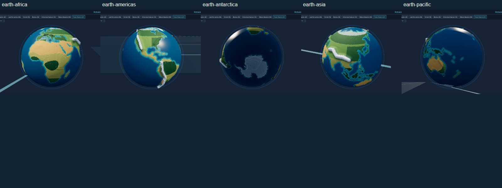
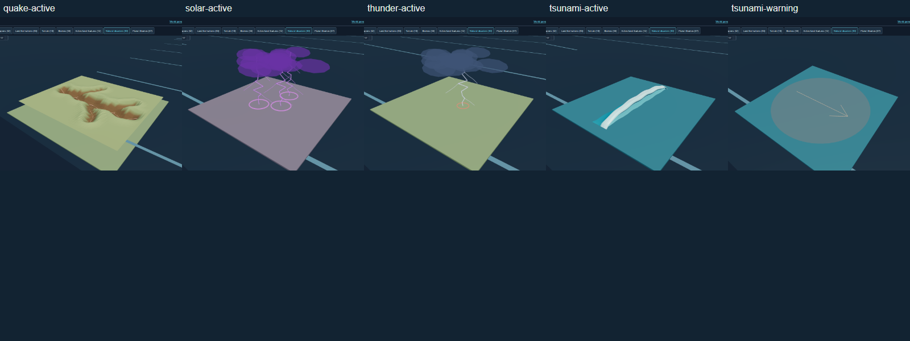

# Natural worlds acceptance

U115-U125, September 12, 2026. Implementation: `c699def`, following `0cd405a`.
Published and publicly verified as V2 `67e14d0` through
[Pages run 34731406144](https://github.com/majieddd/worldheart/actions/runs/34731406144).
[278 file/source identity comparisons](evidence/public/identity.json) passed;
main remains `1374122`. [Request ledger](../NATURAL-WORLDS.md) and
[research/provenance](RESEARCH.md).

## Result

Natural bridge roofs grow from the actual sampled banks, with eroded outlines,
rock thickness, shared biome colors, strata and faceted shading. Glacial trough,
grotto, daylight cavern and stone arcade have separate connected navigation
levels. Units follow the selected crossing without switching to the floor
below it. Footprints, movement, dropped weapons and saved victory salvage retain
their physical level. Floating ribbon decks share the terrain painting path.

Three sky mesa variations add stretched reef shelves, crowned islands and deep
hanging shards. Sky packs include these families. The total is 55 formations;
the other current registries remain 10 terrains, 44 biomes, 12 active features
and 37 themes. Removing ashfall and cryovolcanic outburst leaves 10 disasters.
The independent cryovent active feature remains available.

Earthquakes now open branching fissures, with a flashing red seam and an exact
surface forecast. Disrupted nests collapse once. Lightning uses connected
forked channels; tsunamis have a continuous curling front, foam and a directional
warning. Radiation has purple clouds and arcs. Struck towers lose firing,
charging and summoning for eight simulation seconds, show a purple power ring,
and recover. Pause and tower upgrades do not bypass the disable.

Earth uses sourced Natural Earth coastlines with major islands, Antarctica and
correct east/west orientation. Geographic mountain belts, deserts and forests
replace the earlier coarse outlines and random relief. This remains a stylized,
exaggerated globe, not an elevation survey. Seeded density fields distribute
scenery and compatible active features in irregular clusters and clearings.

## Verification

| Check | Evidence and result |
|---|---|
| Rules and geometry | [329/329 tests](evidence/tests.txt), including actual autonomous movement above and below four bridge families, floating-roam height and salvage height validation |
| Debug registry and UI | [265/265 checks](evidence/debug.json): all 244 exhibits, animation, input, responsive layouts, reduced motion, contrast and no save access |
| Whole-world generation | [108/108 aggregate checks](evidence/worlds.json) across 10 packs and 37 themes; certified battlefields and eleven nest approaches each; whole-world dry-passage connectivity |
| Native bridge and EMP | [20/20 checks](evidence/bridge-emp.json): ally traversed a generated bridge, enemy advanced 65.6 of 66.9 metres, both stayed up to 11.1 metres above the floor; six tower families disabled and recovered; outside tower unaffected |
| Active environment | [23/23 checks](evidence/environment.json): actual friendly/enemy effects, placement compatibility, hemisphere coverage and geological volcanic placement |
| Ledges, nests and HUD | [23/23 checks](evidence/living.json): physical takeoff and landing, actual nest destruction, forecast-to-terrain maximum error 0, preserved footprints, no duplicate reward and responsive alerts |
| Sky and geyser controls | [8/8 checks](evidence/surfaces.json): commander spawn and landing, actual enemy upper-network movement, tower anchoring, keyboard-controlled walk-off and geyser lift |
| Cameras and classic routes | [7/7 suites](evidence/cameras.json): five original map modes plus All Planet and Saturn; all booted and passed their camera contracts |
| Completed defense | [Ten-wave victory](evidence/defense.json), seed 12345: 20 base lives, 278 kills, six towers, then [normal extraction to Planet 2](evidence/arrival.json) |
| Native rendering | [Debug profile](evidence/debug-performance.json): 10.7-second startup; gallery p99 14.1 ms, animated units p99 7.2 ms |
| Earthquake work | [Native quake profile](evidence/weather.json): p50 7 ms, p99 14 ms, maximum 69.4 ms; largest work slice 10.8 ms; 27,382 nodes / 17,268 vertices updated; camera responsive and simulation resumed |
| Distribution and art | [Inspection captures](evidence/inspection.json), reviewed at deliberate angles and event times; bridge families, three sky variants, five Earth views, lightning, radiation and both tsunami phases |
| Build | 93/93 modules parse; style gate passed; 95 bundled modules; 102 preview mirrors match source |
| Public behavior | 33/33 targeted checks on V2: [20 bridge/EMP](evidence/public/bridge-emp.json), [eight sky/geyser](evidence/public/surfaces.json), [three Earth](evidence/public/earth.json) and [two visual/warning](evidence/public/inspection.json); deliberate inspection views captured against the published site |

The defense used legal purchases, placements, rewards and extraction, with
instrumented simulation time and sparse rendering. It is not a blind human
run, a full 99-planet campaign, a loot-balance study or a native-frame benchmark.
Environmental and bridge fixtures deliberately place actors/events to exercise
contracts. Native performance values describe this machine and bounded scenes.

## Adversarial findings retained

- [Initial world sweep](evidence/worlds-first.json) passed 107/108. Submerged
  roofs incorrectly contributed dry nodes on Earth. They now remain water;
  structural bridges also respect Earth's cold geography. Targeted Earth and
  affected-world reruns replace that failed case in the aggregate report.
- Visual inspection caught mirrored Earth geography despite valid numerical
  coastline samples. The spherical longitude convention and hemisphere
  inspection views were corrected; the [final Earth battlefield](evidence/earth-final.json)
  also passed its routes.
- [Sky profiling before](evidence/sky-before.json) showed rejected candidates
  repeatedly building roughly 190,000-node caps. A cheaper scout precedes the
  unchanged final certificate. [After](evidence/sky-after.json), the two measured
  sky cases took 34-36 seconds instead of 61-83 seconds.
- [First sky controls](evidence/surfaces-first.json) exposed autonomous roaming
  resetting the commander to the ocean floor because floating networks use
  their primary graph layer. Movement now recognizes that floating surface;
  the regression and native rerun pass.
- [First ledge fixture](evidence/living-first.json) assumed a drop began at its
  first sampled point. The new terrain included a descending approach. The
  corrected check records the actual takeoff transition; it verifies exact
  height preservation rather than loosening the tolerance.
- Bridge banks were sampled across their width after an earlier probe found
  a discontinuity. Footprints now respect vertical separation; quake refresh
  rechecks bank continuity without reallocating node identities. Rewards and
  victory reloads retain the same surface level.

## Visual review sheets

Full-resolution captures are adjacent to these sheets. They show the shared
production Debug models; physical routing and storm effects have separate
native evidence above. [Jungle](evidence/biomes-jungle-density.png) and
[tundra](evidence/biomes-tundra-density.png) show the irregular patch placement,
varied size and orientation in the biome lane.
