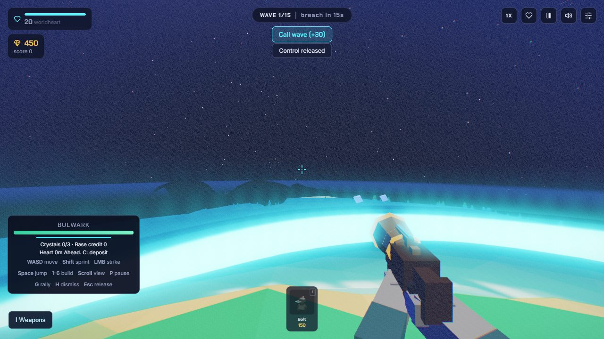
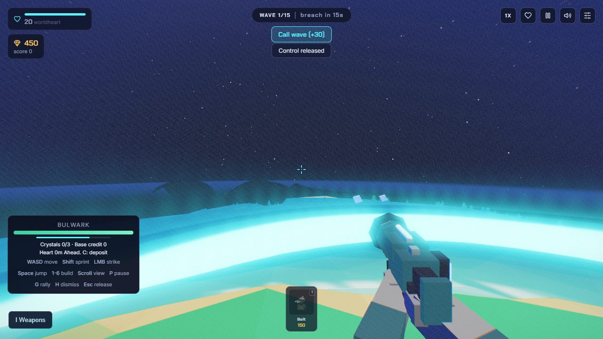
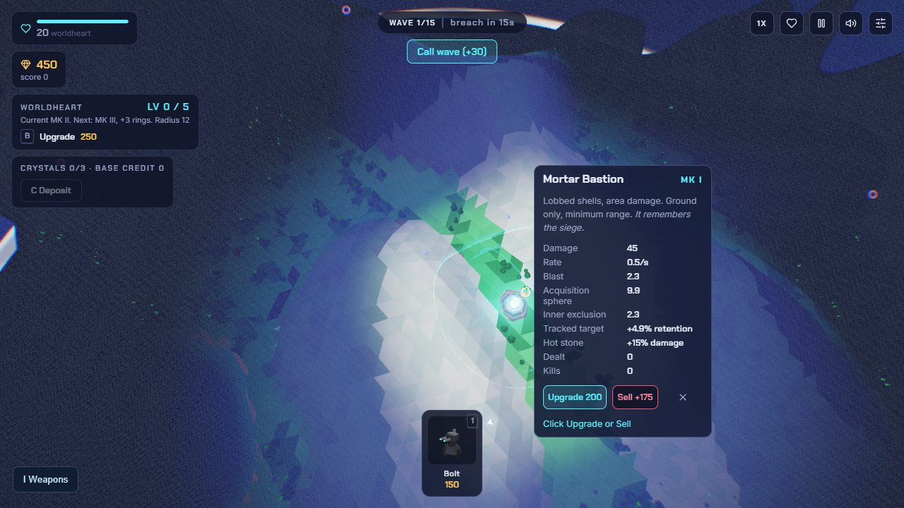

# Terrain routes, nest targeting and connected weapons

2026-09-09. Owner: Codex. Branch: `feature/terrain-routes-and-arsenal`,
based on preview `79d6050`. Tracks #1, M1 #3, M3 #5, M4 #6 and M5 #7.
Status: locally verified; V2 publication pending.
Usage unmeasured. The original main game remains separate under the
[V2 workflow](../../PREVIEW.md).

## Owner feedback and implemented behavior

| Report | Current change | Acceptance boundary |
|---|---|---|
| Empty spaces block movement near spawn | Removed the forest-density walkability mask. Flat gaps and trunks are passable; real slopes, battlefield boundaries and tower footprints still constrain movement. Commander movement tracks nearby nav cells instead of repeatedly scanning the whole graph. | 24 continuous headings from the actual spawn and 12 nearby forest approaches; terrain/tower boundary checks at 30/60/120Hz |
| Towers should attack nests | Bolt, Mortar, Tesla and Helios acquire established, vulnerable nests inside their actual 3D range. Living enemies take priority. Projectile, chain, splash and burn damage share the nest destruction callback and pay the reward once. Cryo remains a slow field, Warden a unit producer. | 16 real attack/lifecycle fixtures, including guarded/dormant/destroyed exclusions and exactly one 180-gold reward; natural siege balance remains open |
| Mix smooth and rugged mountains | Regional ruggedness adds craggy upper ridges to some ranges, fading through foothills and eroded passes. Rounded shoulders and deep canyons remain. Classic map height formulas are unchanged. | Fixed-field shape comparisons and four actual terrain profiles; owner scale/shape approval remains open |
| Ground mobs should follow floor lanes | Ground enemies use a separate floor-first field. Any available floor route beats a mountain shortcut. A disconnected region gets an emergency mountain passage at 8% speed, further subject to ordinary slope/slow effects. Chase, separation, recovery and knockback obey the same certified floor region. | All 99 isolated destination routes and full placement oracles; this is not 99 combat victories |
| First-person guns look disconnected | One canonical grip-space model now supplies the held prop, commander and loot preview. Receiver, stock, barrel, sights, support grip and attachments physically meet. All four weapon families have ancient, technological and empowered silhouettes, closing the missing M4 authored-set implementation item. | 12 rendered family/era fixtures and geometry connectivity checks; owner art acceptance remains open |
| Third-person sword thrusts instead of slashing | Shoulder and torso rotation carry the blade sideways through the active frame. The elbow is set before contact, the wrist preserves blade orientation, and both swing directions continue moving through impact. Lobbers use braced recoil instead of an overhand grenade motion. | Numerical contact direction/velocity checks and 14 rendered phase views; damage timing and combat values remain unchanged |

## Reproductions and adversarial corrections

The previous tree fix removed camera obstruction from actual tree meshes.
That did not remove a separate forest-density mask used by body navigation.
The new reproduction found all twelve flat forest approaches blocked, including
empty space between trunks. The old statement that body movement already passed
through all tree regions was too broad. Removing decor meshes was an insufficient
control because the hidden mask remained. The current test walks across the
mask itself. Requested seed 12345 changed from effective 36102 to 44021 after
world generation and heart selection changed; site coordinates are not treated
as an identical-layout comparison.

Ground routing preserves ordinary point-to-point and placement reachability
fields for commanders. A second field first certifies reachable floor and then
connects remaining regions with expensive mountain edges. Preview paths also
honor this rule. An independent oracle recomputes floor reachability and then
weighted directed paths with forbidden floor exits, including new/sold towers
and isolated living enemies. Preview queries never mutate live ground, march,
air or tower fields.

The initial new preview implementation repeatedly searched disconnected floor
regions and used an unsuitable distance estimate for emergency routes. A
corrected, legal-position benchmark exposed the resulting hitch. The repair
certifies the incoming rim of a proposed footprint, shares successful route
suffixes and removes proven disconnected regions. Emergency A* uses a separate
unconstrained weighted lower bound, computed when the live field changes.
An attempted full floor flood on every hover was correct but too expensive and
was discarded. Both failed timings remain recorded.

The former straight-line placement benchmark landed entirely on denied sites
after the seed/layout change, silently skipping route validation. Its early
8.3/24.3ms timings are not evidence for full legal placement. The tool now
requires at least twelve proven legal positions and reports validation calls.
An intermediate fixture also omitted the tower definition argument; that
execution failed and is retained separately from gameplay defects.

Weapon assembly review found a floating rail, sight, foregrip and empowered
mount in intermediate variants. The final geometry check independently finds
connected triangle solids, then checks that their touching bounds form one
assembly around the grip. This catches unsupported components, but is not a
proof of perfect surface topology. Final-lighting renders supplement it.

## Verification and retained evidence

- [237 tests](TERRAIN-ROUTES-ARSENAL/core.txt) pass, including floor detours,
  emergency crossings, blocked exits, floor-safe knockback, 12 weapon
  assemblies and both slash directions.
- [Spawn before](TERRAIN-ROUTES-ARSENAL/spawn-before.json) and
  [spawn after](TERRAIN-ROUTES-ARSENAL/spawn-after.json): twelve nearby forest
  approaches now pass. The 24-heading record retains legitimate terrain stops.
- [16 nest targeting checks](TERRAIN-ROUTES-ARSENAL/nest-targets.json) use actual
  attack simulation and destruction callbacks, with towers and HP repositioned
  for isolation. They do not establish natural campaign siege balance.
- [96 placement/preview oracle cases](TERRAIN-ROUTES-ARSENAL/placement.json) and
  [180 commander path comparisons](TERRAIN-ROUTES-ARSENAL/point-paths.json).
- [All 99 destinations](TERRAIN-ROUTES-ARSENAL/all-99.json): 1,485 isolated
  arrivals, no floor-route escapes or flight-ceiling violations. One remote
  legacy source on planet 39 needed 1,595.2 simulated seconds. The original
  1,500-second failure is retained; completing it at a larger budget proves
  arrival, not acceptable waiting time. Actual near-frontier nest sites are
  [tested separately](TERRAIN-ROUTES-ARSENAL/nest-nav.json): 486 arrivals from
  nine sampled planets at three expansion levels, without floor/ceiling
  violations. The maximum-expansion canyon route takes 856.1 simulated seconds.
  [The original 500-second timeouts](TERRAIN-ROUTES-ARSENAL/nest-nav-timeout.json)
  remain as pacing evidence, not stuck-enemy claims.
- [36 landform assertions](TERRAIN-ROUTES-ARSENAL/landforms.json) across four
  profiles and three fixed seeds preserve the previous pillar-removal gate.
  [Four generated profiles](TERRAIN-ROUTES-ARSENAL/terrain.json) pass terrain,
  climate placement and range checks. This is a mixed-ruggedness iteration,
  not an owner-approved final biome library.
- [Five map regressions](TERRAIN-ROUTES-ARSENAL/maps.json),
  [ten surface checks](TERRAIN-ROUTES-ARSENAL/surfaces.json),
  [28 contextual checks](TERRAIN-ROUTES-ARSENAL/feedback.json),
  [22 previous comfort checks](TERRAIN-ROUTES-ARSENAL/comfort.json),
  [12 anatomy checks](TERRAIN-ROUTES-ARSENAL/proportions.json), and
  [21 strike groups](TERRAIN-ROUTES-ARSENAL/strikes.json) covering 300 terrain
  probes all pass.
- [Twelve weapon family/era views](TERRAIN-ROUTES-ARSENAL/weapon-poses.json)
  and a [slow phase-review video](TERRAIN-ROUTES-ARSENAL/slash.mp4) retain actual
  model/rig output. These are injected poses, not player combat or FPS evidence.
- [First legal replay](TERRAIN-ROUTES-ARSENAL/first-run.json): a fresh 15-wave
  victory with 10 heart health, 1,050 kills, score 19,720 and 13 weapons
  [actually extracted to planet 2](TERRAIN-ROUTES-ARSENAL/first-arrival.json).
  This used legal purchases, cards, placements and commander actions at 60Hz
  simulation with sparse rendering. It is source-informed, not blind play.
  After the later navigation-cache/preview/model changes,
  [the final assault replay lost at wave 14](TERRAIN-ROUTES-ARSENAL/final-assault-defeat.json)
  with 503 kills, score 9,890 and 13 inventory weapons. A separate
  [cautious policy reached wave 15 before defeat](TERRAIN-ROUTES-ARSENAL/final-cautious-defeat.json),
  with 865 kills and score 16,790. Both have zero runtime faults and retain
  their actual results. The earlier win is not a victory claim for final source.

## Performance

The legal-position moving-preview fixture uses 45 sites, 274 route validations,
240 measured frames, paused combat and 1280x720 rendering on the same GPU.

| Case | Initial new-route p99 frame | Final p99 frame | Final main-thread p99 work |
|---|---|---|---|
| Native | 31.7ms | 8.5ms | 8.6ms |
| 4x CPU slowdown | 167.3ms | 54.7ms | 45.0ms |

The translucent veil itself keeps two geometry identities and costs at most
0.1ms native / 0.4ms at 4x CPU at p99. Route work remains more expensive under
CPU slowdown. See [initial legal-position failure](TERRAIN-ROUTES-ARSENAL/range-before.json),
[expensive full-flood attempt](TERRAIN-ROUTES-ARSENAL/range-flood.json),
[final measured fixture](TERRAIN-ROUTES-ARSENAL/range-final.json), and
[invalid-position earlier probe](TERRAIN-ROUTES-ARSENAL/range-invalid-coverage.json).

The separate 60-second combat stress fixture retains 100 enemies, 30 towers,
continuous camera orbit and active simulation. The final 4x CPU result is
64.94 FPS median but 42.7ms p99, with no runtime faults. It still fails the
frame-time budget. The earlier profiled run's 46.2ms p99 is not a controlled
before/after comparison, and no measured combat FPS gain is claimed from the
nearby-node optimization. [Full stress record](TERRAIN-ROUTES-ARSENAL/stress-4x.json).
Hardware: i9-13900H, RTX 4080 Laptop GPU, Chrome 152, 1280x720/DPR 1.
DevTools slowdown on this GPU does not represent an actual lower-end device.

## Animation reference and interpretation

The owner's AAA reference request was checked against Ubisoft's
[For Honor Art of Battle explanation and official combo imagery](https://www.ubisoft.com/en-gb/game/for-honor/news-updates/3i9GE9e7XGWHqKQH2wUtZc/for-honor-the-art-of-battle)
and Bethesda's [official DOOM Eternal gameplay reveal](https://bethesda.net/en-US/news/doom-eternal-official-gameplay-reveal).
The Ubisoft sequence was inspected as a movement reference; the Bethesda page
linked its first-person gameplay video, but full video playback was unavailable
in the research tool. No claim of viewing that entire video is made.

The adaptation is authored for this game's existing faceted rig: torso-led
anticipation, lateral edge travel through contact, follow-through and recovery;
coherent held-gun construction and restrained launcher recoil. No external
models or animations were copied, and this is not a claim of equivalent AAA
animation quality. Copyrighted reference captures remain local research files.

## Remaining acceptance

The six actionable reports above and the missing authored era shapes are
implemented. Public deployment verification is pending. Full 99-planet natural
combat completion, low-capability frame time, actual device/background-tab
coverage, broad balance/foliage review and owner art/feel approval remain open.
The long emergency route also needs natural pacing evaluation. Main rename,
multiplayer/PvPvE and native Roblox/Fortnite feasibility follow those gates;
this batch does not close M0-M6 or merge gameplay into main.
