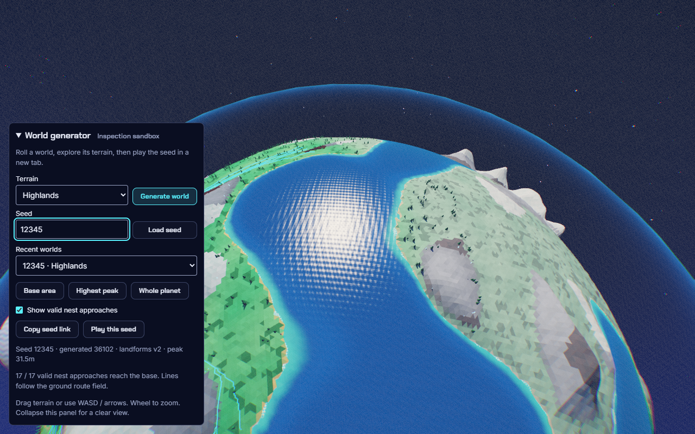
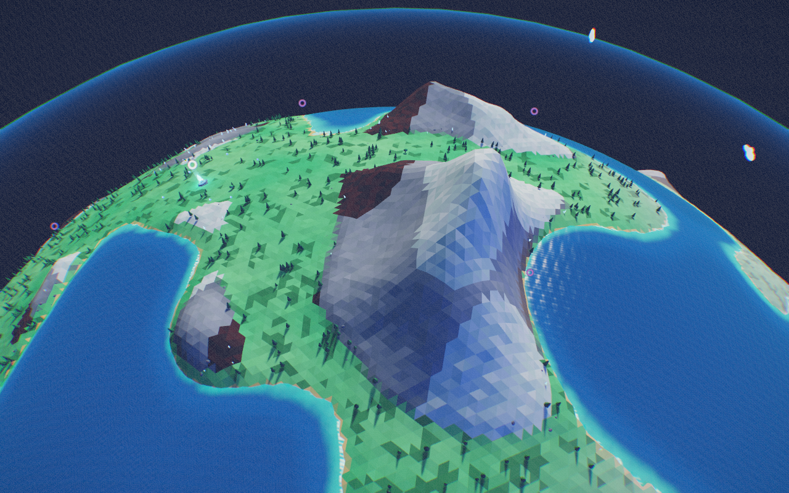
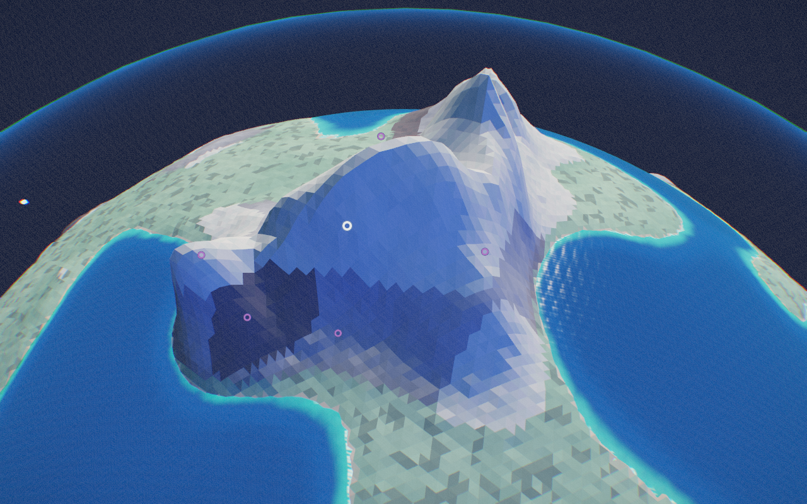

# Zoom comfort and world generation, September 11

Owner: Codex on `feature/worldgen-lab-and-ridges`, based on preview `08e8050`.
U35-U37 / tracker #1, camera #3 and terrain #5. Status: published and publicly
verified through [PR #30](https://github.com/majieddd/worldheart/pull/30).
Main stays unchanged.

The owner's playtest rejects the excessive overview from U33. That check proved
the cap fit, but did not establish acceptable camera feel. Restore the previous
zoom band with a modest maximum-height increase. Keep the polar fix and loot.

## Implemented behavior

- U35: the old zoom band returns with 0-10% extra maximum height as the base
  grows. Defaults start at 46.8m and end at 124.08m, rather than the rejected
  full-cap overview. Starting distance, pitch settings and the pole repair stay.
- U36: **World generator** on the title or Settings opens an inspection tab.
  Generate/load seeds, revisit the last 12 worlds, copy a link, select four
  terrain mixes or classic whole-planet terrain, inspect the base/highest
  battlefield peak/globe, and show 17 valid potential nest approaches.
  **Play this seed** opens a normal single-planet sandbox. Opening from an
  active battle pauses that battle. Current campaign planet seed/profile are
  used for the launch, including later planets' derived seeds.
- The inspector stays in the non-simulating title state, hides ordinary HUD,
  and uses separate `whWorldgen:` storage. New worlds reload the complete scene
  lifecycle. Requested and accepted seeds are both displayed. Links replay the
  requested seed with the CURRENT generator; they do not freeze old versions.
- U37: landforms v2 joins selected neighboring automatic ranges into open
  chains of two or three cells. Shared pointed/folded spines cross their
  internal seams; rounded feet meet the existing outer valley network.
  Isolated ranges, foothills, canyons, basins and mesas remain. Explicit
  authored groups keep their own height/size contract and are not merged.
- Nest placement still requires dry, clear, floor-connected exits. Its score
  now includes twice the wet distance along the entire existing route, so
  offshore clearings lose to suitable dry approaches. Water remains a fallback;
  mountain emergency speed and tower placement/range rules are unchanged.

The inspector reuses the existing brand palette, typography, focus styles and
button primitives as one collapsible component. It adds no repeated UI motion.
Measured normal/muted text contrast is 16.20:1 and 7.73:1 against its opaque
ground. Keyboard focus, typing without camera movement, collapse and widths
390/768/1280 all pass. This is not a screen-reader or touch-control signoff.

## Evidence

| Check | Result and artifact |
|---|---|
| Core and contracts | [265 tests](WORLDGEN-RIDGES/unit-tests.txt), including spatial oracle, continuity across real internal ownership boundaries, explicit authoring, dry-approach preference, storage isolation and bounded zoom |
| Generator DOM and render checks | [24 cases](WORLDGEN-RIDGES/ui/results.json), no runtime faults; seed regeneration/replay, exact normal-play handoff, classic comparison, clipboard denial recovery and campaign save preservation |
| Matched rendered comparison | [Same accepted seed, camera position, target and lens](WORLDGEN-RIDGES/comparison/results.json) against baseline `08e8050`; highest exposed chain inspected on Highlands and Giant peaks; covers hidden only for inspection |
| Zoom and automatic loot | [64 cases](WORLDGEN-RIDGES/zoom/results.json), including pause/death/draft/full-bag guards and extraction persistence; U35 deliberately replaces the rejected U33 full-cap test |
| Camera regression | [16 polar/input cases](WORLDGEN-RIDGES/poles.json) and [all five maps](WORLDGEN-RIDGES/maps.json) |
| Terrain graph | 75 assertions across requested seeds [12345](WORLDGEN-RIDGES/routes/12345.json), [771](WORLDGEN-RIDGES/routes/771.json) and [92741](WORLDGEN-RIDGES/routes/92741.json), all four mixes: floor connectivity, inland routes, 17 remote sources, relief bounds and a major alpine peak |
| Actual moving bodies | [15,147 arrivals across all 99 planet definitions](WORLDGEN-RIDGES/all99-arrivals.json): 17 sites at three expansion levels, Husk/Mite/Wisp; no stranded bodies, ground-floor escapes or flight-ceiling violations |
| Tower/terrain integration | [96 rendered terrain checks](WORLDGEN-RIDGES/terrain.json) and [96 placement/preview oracle cases](WORLDGEN-RIDGES/placement.json), including elevated/elemental footprints and true spherical range |
| Legal play | [15-wave victory](WORLDGEN-RIDGES/legal/run.json): 543 kills, 24 heart health, 12 nests destroyed, no runtime faults or controller stalls; [13 weapons carried to planet 2](WORLDGEN-RIDGES/legal/arrival.json) |
| Sustained native performance | [60 seconds at 720p](WORLDGEN-RIDGES/performance.json), 30 towers/100 enemies on RTX 4080 Laptop GPU: median 7ms, p95 13.9ms, p99 14ms, max 28ms; simulation and pause/resume checks pass |
| Generated outputs | [57 bundled modules, 60 identical mirror files](WORLDGEN-RIDGES/generated-build.txt); [standalone inspector launch and regeneration](WORLDGEN-RIDGES/bundle.json) pass; source syntax and style pass |

The legal policy uses normal purchase/placement/combat paths and advances time;
it does not inject currency, health or waves. It renders one frame per two
simulation seconds, so it is not continuous-input or performance evidence.
The stress test separately injects a fixed load and is not natural play.
All-99 movement is isolated traversal, not an unforced 99-planet victory.
The final explicit-authoring guard does not change these default terrain mixes;
its targeted authoring test passes separately.







## Retained corrections and adversarial review

1. U33's technical full-cap fit did not establish good camera feel. U35 changes
   that requirement explicitly; historical U33 evidence is preserved.
2. The first generator run timed out because its test required identical query
   parameter ordering on replay. The world had navigated correctly. Launch URLs
   now share one builder and the replay wait compares seed semantics. The
   [failed report](WORLDGEN-RIDGES/retained-failures/ui-link-order.json) remains.
   A blank screenshot after viewport resize was a frozen-RAF harness issue;
   final captures explicitly render after resize.
3. A gallery assumption that a chain must lie near the base failed. A second
   pass used an accepted seed as a new requested seed, which changed the retry
   conditions. Both [first](WORLDGEN-RIDGES/retained-failures/gallery-no-nearby-chain.json)
   and [second](WORLDGEN-RIDGES/retained-failures/gallery-seed-retry.json) failures
   remain. Final comparisons use the original request, assert equal accepted
   seeds and raw camera poses, and inspect exposed chain peaks.
4. Sharper crests changed the accepted canyon layout. Its approach samples
   became only 46.9% inland, exposing dry nest sites with wet journeys.
   [Failure retained](WORLDGEN-RIDGES/retained-failures/canyon-wet-approaches.json).
   Scoring the whole wet approach raises this case to 85.0% inland. No routing
   assertion was weakened; all three requested-seed sweeps pass.
5. Review caught explicit authored height/size being enlarged by automatic
   merging. Authored groups are now excluded from chains. A regression test
   preserves their contract. A new nest fallback fixture initially put its two
   clearings inside the existing six-metre separation radius; blocking the
   alternate clearing tests the intended water fallback without violating it.

## Public checkpoint

Gameplay source `476e8dd40bdd0cfb5002081ac18771d91b5fb0df` is live at
[V2](https://majieddd.github.io/worldheart/v2/) through
[deployment 34582998911](https://github.com/majieddd/worldheart/actions/runs/34582998911).
Review CI, Pages build and deployment passed. [Open the generator directly](https://majieddd.github.io/worldheart/v2/?map=ninetynine&campaign=0&seed=12345&terrain=varied&worldgen=1).

All 104 public behavior cases pass with no runtime faults: [24 generator](WORLDGEN-RIDGES/public/generator.json),
[64 zoom/loot](WORLDGEN-RIDGES/public/zoom-loot.json) and [16 pole/input](WORLDGEN-RIDGES/public/poles.json).
[109 identity/source checks](WORLDGEN-RIDGES/public/identity.json) match the live
preview and original assets plus twelve changed runtime sources. Main remains
`1374122d1109919a5fab10b69fefdfb80308eb6e`. Documentation-only handoff commits
retain this tested runtime; the current deployment SHA is in `/v2/build.json`.
No gameplay PR was merged into main. The review remains a draft because wider
milestone acceptance is still open.

## Reproduce and continue

Serve this checkout with `node tools/serve.mjs` on port 8139. Set
`WH_NODE_MODULES` to a runtime containing Playwright, then run:

```powershell
node tools/worldgen-check.mjs artifacts/worldgen/ui
node tools/base-loot-check.mjs artifacts/worldgen/zoom
node tools/formation-check.mjs artifacts/worldgen/routes --seed=12345
node tools/nest-nav-check.mjs artifacts/worldgen/all99 --planets=$((1..99) -join ',')
node tools/terrain-check.mjs artifacts/worldgen/terrain
node tools/placement-preview-check.mjs artifacts/worldgen/placement
node tools/self-play.mjs 12345 artifacts/worldgen/legal --campaign --planets=1 --weapons --strategy=assault --sparse-render
node tools/performance-check.mjs artifacts/worldgen/performance --seconds=60 --compact
```

The gallery additionally needs baseline `08e8050` served at port 8140; use
`WH_BEFORE_URL` to change it. Public generator/zoom checks support `WH_BASE_URL`.
Reduced-CPU/device performance, full natural campaign completion, ocean balance
and owner visual/feel acceptance remain in M0-M6. Usage unmeasured.
