# World exploration polish evidence

September 19, 2026. [Scope, contracts, sources and limits](../implementation/WORLD-EXPLORATION-POLISH.md).
Runtime source: `feature/world-exploration-polish`, baseline `0036b84`.
The publication record in the implementation ledger identifies the deployed commit.

Reports preserve their original details, including fixture setup and failures.
`manifest.json` hashes the bundled raw reports and compressed image copies.
Original PNGs, all intermediate attempts and logs remain in `artifacts/world-polish/`.
Local paths in reports identify captures; the review images below are portable.

| Evidence | What it establishes |
| --- | --- |
| [Automated suite](tests.log) | 425 tests pass; no skipped tests |
| [Opening](opening.json) | 33 checks including actual desktop/touch building, upgrades and tutorial actions |
| [Lifecycle](lifecycle.json) | 11 checks: camera maps, accelerated wave queues and home reload; not a natural-play balance win |
| [Exploration](exploration.json) | Nine checks: spherical wall joints, wheel, chest click/ejected models, touch card and two-finger zoom |
| [Catalogue](catalogue.json) | Eleven checks: lobby movement, saved roll/merge, launch and rendered production catalogues |
| [Disasters](disasters.json) | Final meteor/cloud/impact shader and phase capture, with no browser errors |
| [Lobby gates](lobby-audit.json) | Three open-shop viewport audits; zero measured failures |
| [Solar routing](solar-routes.tap) | Connected floor paths beside relief in 16 local landmark patches |
| [Legacy comparison](legacy-comparison.json) | 54 old-version cases match baseline height/ocean, support and feature records exactly |
| [Laya trial](laya-recipes.json) | 20 authored recipe choices; model 15/20 vs rules 19/20; all errors and timings retained |
| [Installed Aegis](aegis-installed.json) | Eight exploration checks run through the installed 3.18.14 workflow |
| [Negative control](negative-control.json) | Baseline cannot pass the new wall endpoint scenario |

Earlier input/catalogue failures and the native input's default-color warning
are retained as `failed-*.json`. The implementation ledger explains corrections.

## Playable views

[V2 game](https://majieddd.github.io/worldheart/v2/),
[commander courtyard](https://majieddd.github.io/worldheart/v2/lobby.html),
[meteor exhibit](https://majieddd.github.io/worldheart/v2/debug.html#disasters/meteor).

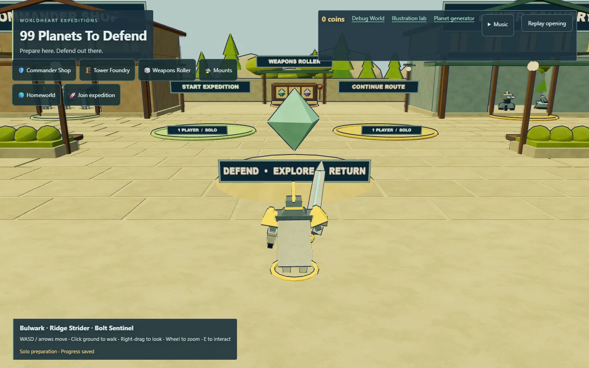
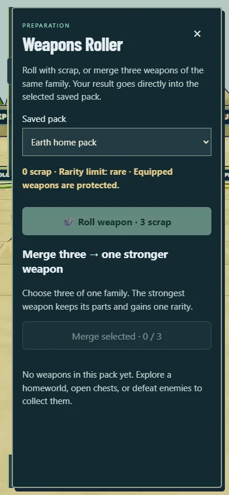
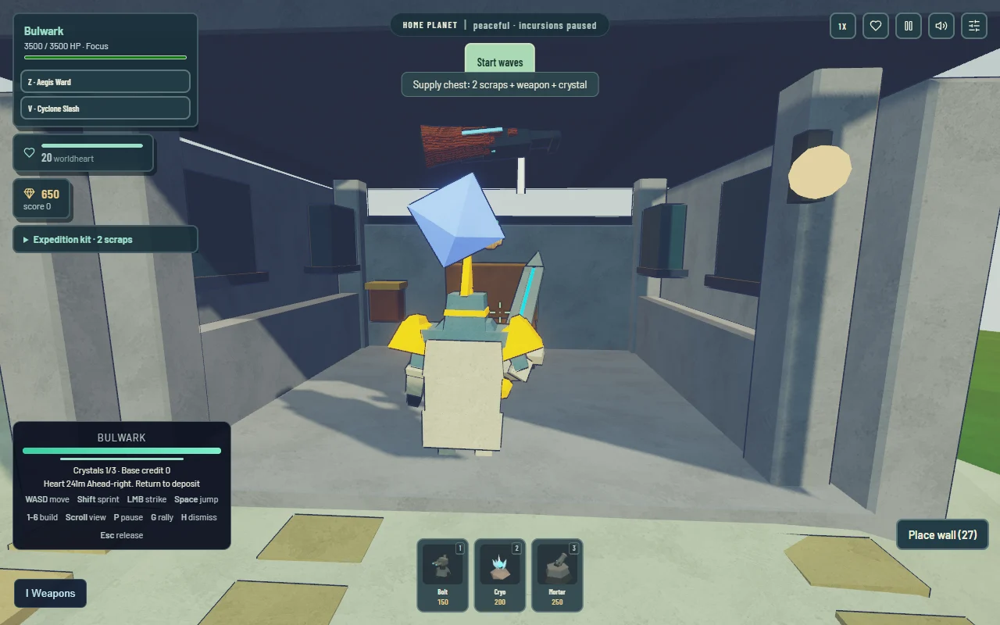
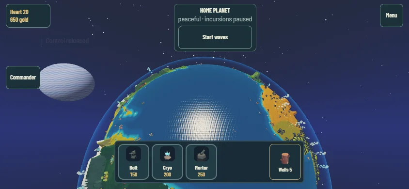

## Visual review sheets

These are production-builder captures. Disaster phase frames intentionally freeze
warning, approach and impact for inspection. Planet thumbnails are gallery
representations; route probes and playable Earth checks are separate evidence.

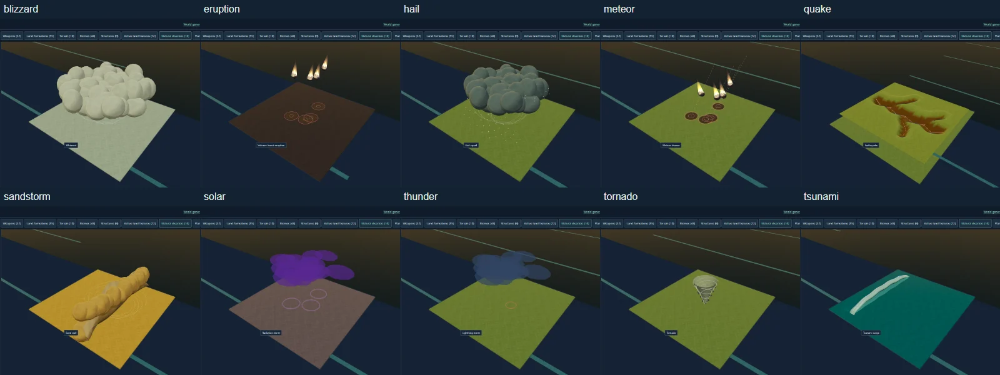
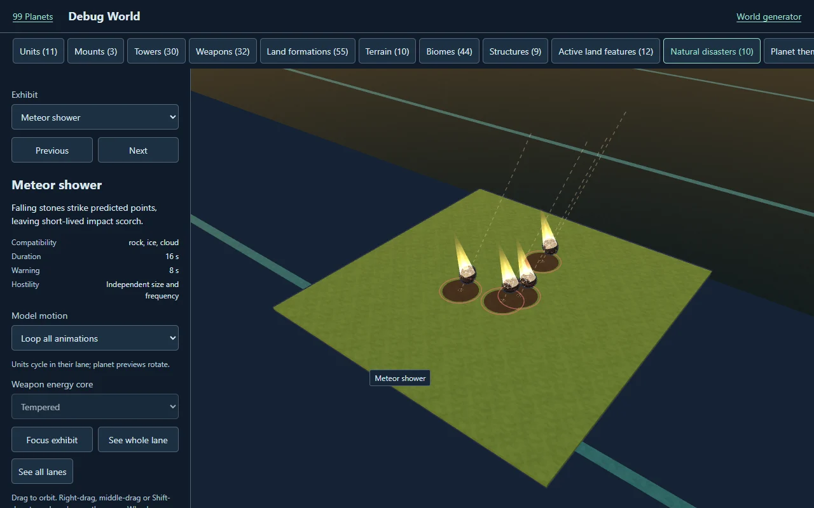
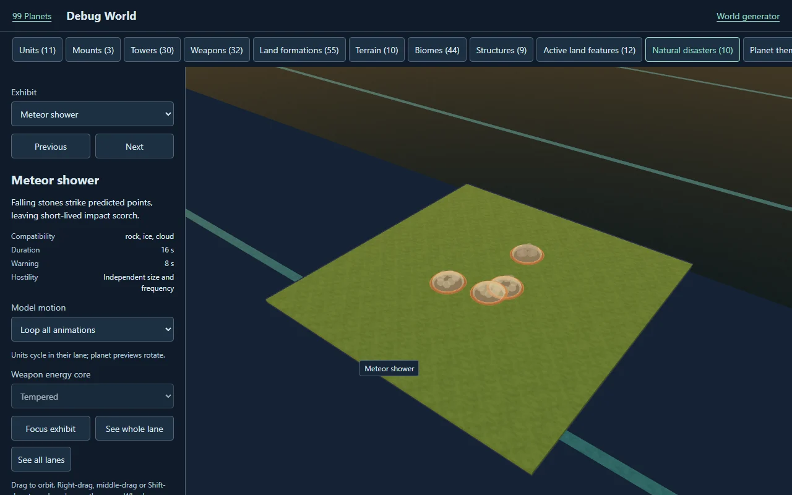
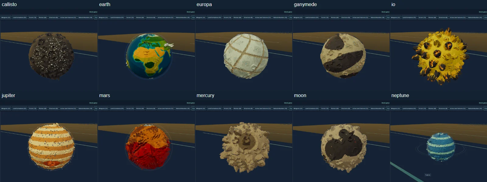
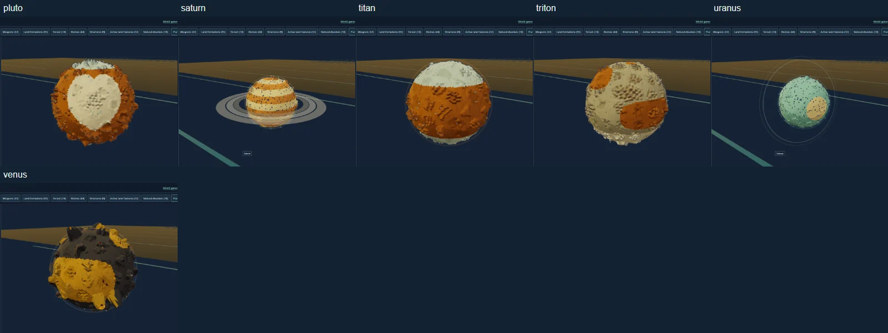
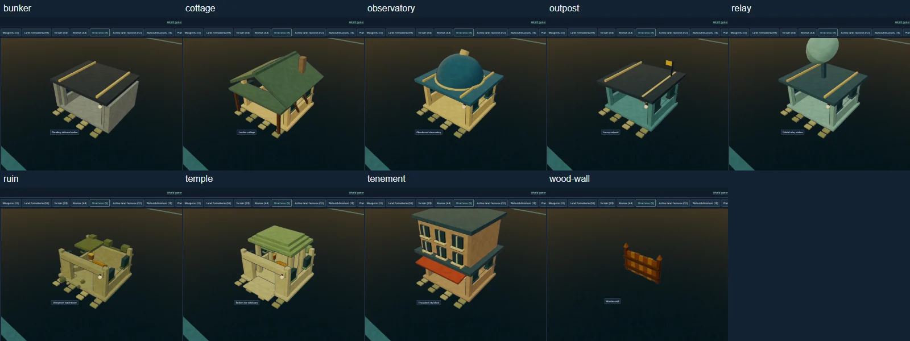
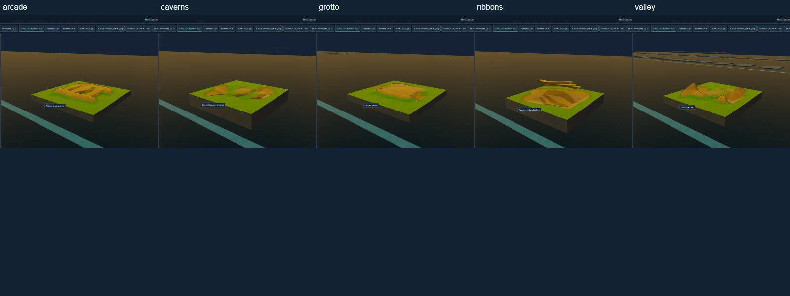
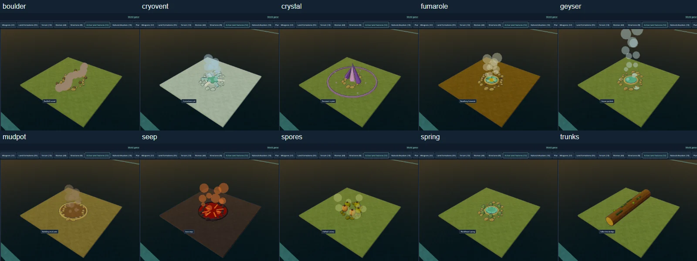
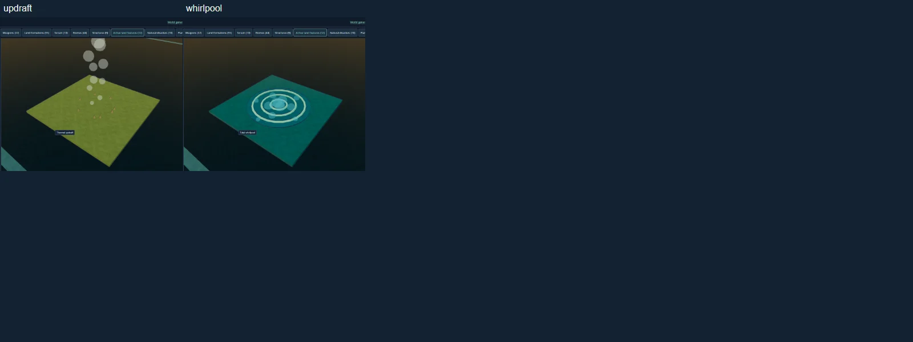
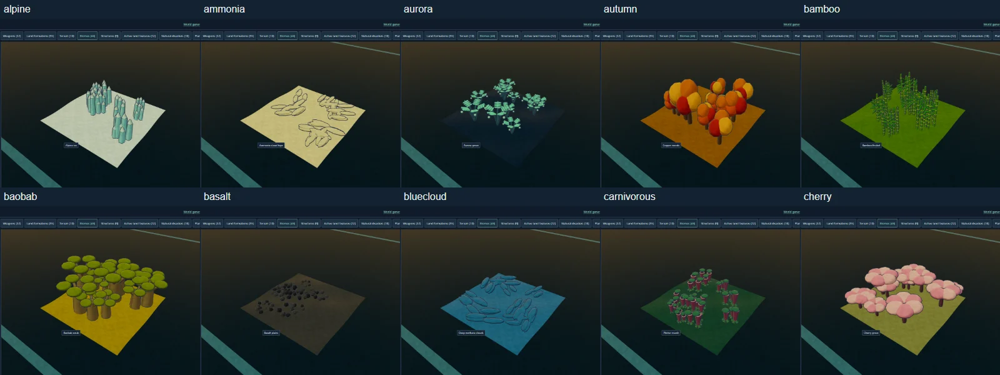
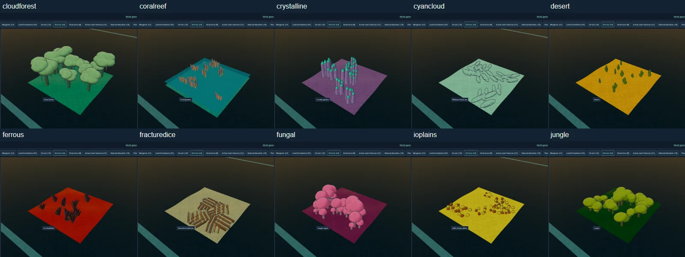
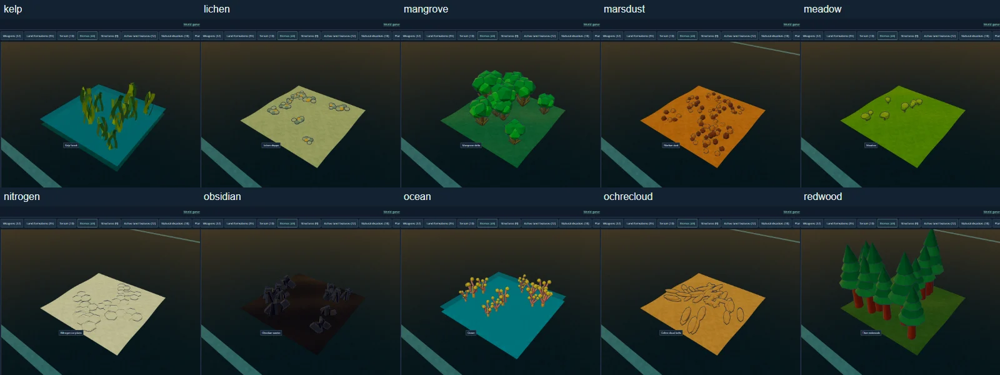
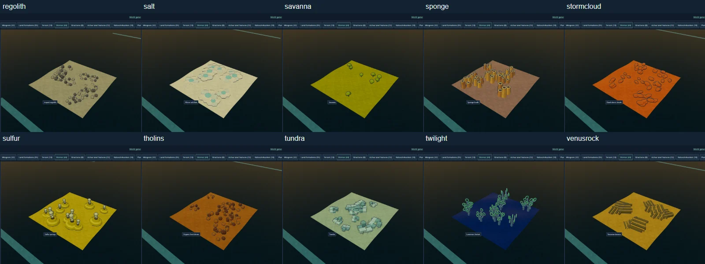
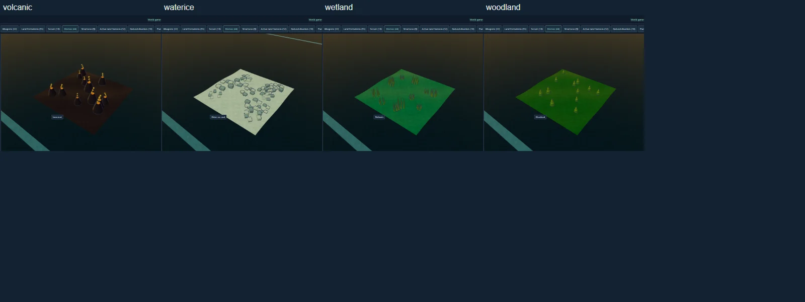

Touch is browser emulation. Physical-phone performance, owner art/audio feel,
full natural campaigns and the older under-5/10-second generation target remain
unverified. The Laya result supports keeping inference out of runtime.
